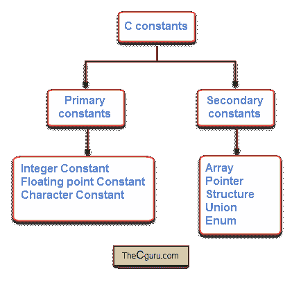
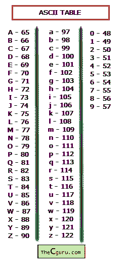

# C 语言中的常量

> 原文:[https://overiq.com/c-programming-101/constants-in-c/](https://overiq.com/c-programming-101/constants-in-c/)

最后更新于 2020 年 7 月 27 日

* * *

常量或有时称为文字是一个不变的实体，而变量是一个可以变化的实体。在本节中，我们将讨论常量，变量在第[课中讨论，变量在 C](/c-programming-101/variables-in-c/) 中讨论。

## 常量的类型

在 C 语言中有两种类型的常量:

1.  主要常量。
2.  次要常量。

如图所示，这两种类型进一步分为更多类别。

这里我们将只讨论主要常量，次要常量将在后面讨论。要创建主常量，您需要遵守以下规则。

## 数字常量

数字常量是可能有也可能没有小数点的数字。创建数字常量的规则是:

1.  必须至少有一个数字。
2.  不允许使用空格、逗号或任何其他特殊符号。
3.  它可以是正的，也可以是负的，如果整数常量前面没有符号，那么它就被认为是正的。

数字常量有两种类型:

1.  整数常量
2.  浮点或实常量

### 整数常量

整数常量没有小数点(`.`)。它们可以用十进制数(以 10 为基数)、八进制数(以 8 为基数)和十六进制数(以 16 为基数)来写。

**十进制常量**

它包含介于`0`和`9`之间的数字，但不应以零开头。

```c
43, 199, 3452, -100

```

**八进制常量**

包含`0`和`7`之间的数字，必须以零开头。

```c
012, 034, 01144

```

**十六进制常量**

包含从`0`到`9`的数字，以及从`a` - `f`的字母(大写或小写)，必须始终以`0x`或`0X`开头。

```c
0x23, 0Xff, 0x37a

```

如前所述，字母可以是大写或小写。

```c
0x23, 0XFF, 0x37A

```

我们也可以混合十进制、八进制和十六进制。

```c
int i = 12 + 045 + 0x3a

```

永远记住，无论我们用什么数字系统来表示一个数字；它们对如何在内存中内部存储没有影响(最终每个数字和字符都存储为二进制数字流)。八进制和十六进制是编写低级程序时常用的，所以，在开始的时候，你不会看到太多。

默认情况下，整数常量的类型为`int`。在 32 位系统中，`int`类型占用 4 字节内存。如果一个整数的值太大而不适合`int`的话，那么常量的类型就提升为`long int`。同样，如果这个值对于`long int`来说仍然太大，那么它最终将被提升到`unsigned long int`。

确定八进制和十六进制类型的规则略有不同，工作原理如下:

编译器将遍历以下类型(从上到下)，直到找到可以表示常量的合适类型。

```c
unsigned int
long int
unsigned long int

```

也可以通过追加`l`或`L`将整数常量的类型明确指定为`long int`:

```c
10l, 3789L, 094l, 0xabL

```

同样，要将整数常量的类型指定为`unsigned int`并在其后追加`u`或`U`:

```c
23u, 034U, 0x8au

```

我们也可以使用`u`或`U`和`l`或`L`将整数常量的类型指定为`unsigned long int`。`89ul` -类型为`unsigned long int`

### 浮点或实常量

有小数点的数字常量称为浮点或实常量。浮点常量可以写成两种形式:

1.  分数形式
2.  指数形式或科学符号

以下是以分数形式创建浮点常量的规则:

1.  必须至少有一个一位数
2.  必须有小数点
3.  可以是正数或负数，默认值为正数
4.  不允许使用逗号、空格或任何其他符号

以下是一些例子:

```c
3.14
899.0
-0.999

```

指数形式用于数字太小或太大的情况。例如`0.00000941`可以表示为`9.41e-6`。`e`之前的部分称为尾数即`9.41`，而`e`之后的部分称为指数即`-6`。

以下是以指数形式创建浮点常量的规则:

1.  尾数和指数必须用`e`或`E`隔开。
2.  尾数可以是正数，也可以是负数，默认值为正数。
3.  指数必须至少有一个数字。
4.  指数可以是正的或负的，缺省值是正的

指数形式的浮点数的一些例子是:

```c
100.34e4
-56E10
0.233E10
-0.94e15

```

默认情况下，浮动常量的类型为`double`。我们可以通过在常量的末尾添加`f`或`F`来明确地将浮点常量的类型称为`float`。例如:

```c
12f , -0.87f

```

同样，我们可以通过在末尾追加`l`或`L`来明确地将浮点常量的类型称为`long double`。

```c
12.13l, -98.12L

```

## 字符常量

字符常量是用单引号括起来的单个字母、数字或任何特殊符号。以下是一些例子:

```c
'A', 'c', '4', '$', '^'

```

**注意:**字符常量必须始终用单引号括起来，所以下面是错误的。

```c
"a"
"e"

```

字符常量的最大长度为 1 个字符。这意味着您不能在单引号中放一个以上的字符，如下所示:

```c
'ab' // Wrong
'12' // Wrong

```

你可能已经知道，在计算机内存中，所有东西都是以二进制形式存储的。很容易看出整数和浮点常量是如何存储为二进制数的。但是字符常量是如何存储在内存中的呢？事实证明，每个字符常量都有一个唯一的整数与之相关联。ASCII 表表示用于表示英语中每个已知字符的十进制数。



请考虑以下陈述:

```c
char ch = 'a'; // declaring a variable ch and assigning 'a' to it

```

这里我们声明一个类型为`char`的变量`ch`，并为其分配一个字符常量`'a'`(现在不要太担心语法，在[下一章](/c-programming-101/variables-in-c/)中我们将详细讨论变量)。虽然看起来我们将`'a'`分配给变量`ch`，但实际上分配给`ch`的是`'a'`的 ASCII 值，即 97。这里有一个小秘密——在 C 语言中，字符被视为小整数，所以它们实际上有`int`类型而不是`char`类型。A `char`或`signed char`的范围为-127 至 128，而 a`unsigned char`的范围为 0 至 255。

## 串常量

字符串常量由用双引号(`""`)括起来的零个或多个字符组成。在字符串的末尾，编译器会自动放置空字符`'\0'`。以下是字符串常量的一些示例:

```c
"hello"
"123"
"" // This is empty string it consists of only one character '\0' which is added by the compiler automatically.

```

**注意:**虽然不是 Primary 常量的正式组成部分，但为了完整起见，这里给出了字符串常量。c 没有字符串的数据类型，它们存储为字符数组。我们将在它自己的章节中详细了解字符串。

## 符号常量

如果我们想在一个程序中多次使用常量，那么我们可以为它提供一个名称。例如:如果程序中有几个地方需要用到常量`Π = 3.141592`，那么我们可以给它取一个名字，用那个名字，而不用写这个长数字。这个常量叫做符号常量。它通常在程序开始时定义。以下是创建符号常量的语法。

```c
#define NAME VALUE

```

`#define`是一个预处理器指令，就像`#include`一样，这就是它不以分号(`;`)结尾的原因。

`NAME`表示我们想给常量取的名字，一般用大写。

`VALUE`可以是数字、字符或字符串常量。让我们创建一个名为`PI`的符号常量。

```c
#define PI 3.141592

```

程序编译时，预处理器用其值替换`PI`的每次出现。因此声明:

```c
printf("Circumference of circle = %f", 2*PI*4);

```

成为

```c
printf("Circumference of circle = %f", 2*3.141592*4);

```

符号常量的使用使程序更易于维护和阅读。例如:假设我们想要更精确的结果，所以我们决定将`Π`的值从`3.141592`更新为`3.14159265359`，如果我们没有使用符号常量，那么我们将不得不经历`3.141592`的每次出现并更新它们。然而，由于我们已经在`#define`指令中定义了`PI`，我们只需要在单个地方进行更改。

* * *

* * *