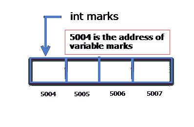
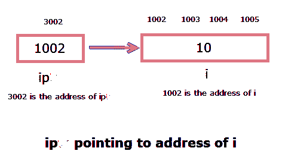
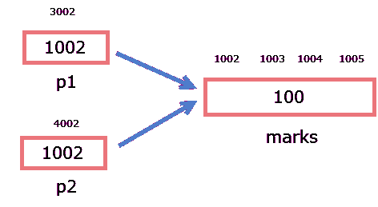

# C 语言中的指针基础

> 原文:[https://overiq.com/c-programming-101/pointer-basics-in-c/](https://overiq.com/c-programming-101/pointer-basics-in-c/)

最后更新于 2020 年 7 月 27 日

* * *

C 的真正力量在于指针。指针一开始有点难掌握。看完指针的基础知识后，你会对它们是什么以及如何使用它们有更好的了解。

## 什么是指针？

指针是用于存储内存地址的变量。让我们首先了解一下内存在计算机内部是如何组织的。

计算机中的内存是由字节(一个字节由`8`位组成)按顺序排列而成的。每个字节都有一个与之相关联的数字，就像数组中的索引或下标一样，这被称为字节的地址。字节的地址从`0`开始到比内存小一个字节。例如，假设在 64MB 的内存中，有`64 * 2^20 = 67108864`字节。因此这些字节的地址将从`0`开始到`67108863`。


让我们看看当你声明一个变量时会发生什么。

```py
int marks;

```

我们知道一个`int`占用`4`字节的数据(假设我们使用的是 32 位编译器)，所以编译器从内存中保留`4`连续字节来存储一个整数值。`4`分配字节的第一个字节的地址被称为变量`marks`的地址。假设`4`连续字节的地址为`5004`、`5005`、`5006`和`5007`，那么可变标记的地址为`5004`。



## 地址运算符(&)

为了找到变量的地址，C 提供了一个名为地址运算符(`&`)的运算符。要找出可变标记的地址，我们需要在它前面放置`&`运算符，如下所示:

```py
&marks

```

下面的程序演示了如何使用地址运算符(`&`)。

```py
// Program to demonstrate address(&) operator

#include<stdio.h>

int main()
{
    int i = 12;

    printf("Address of i = %u \n", &i);
    printf("Value of i = %d ", i);

    // signal to operating system program ran fine
    return 0;
}

```

**预期输出:**

```py
Address of i = 2293340
Value of i = 12

```

**注意:**每次运行程序时`i`的地址可能会有所不同。

**工作原理:**

要找到变量的地址，在变量名前加`&`运算符。关于程序还有一点需要注意的是`%u`转换规范的使用。回想一下`%u`转换规范用于打印无符号十进制数，由于内存地址不能为负数，所以必须始终使用`%u`而不是`%d`。

运算符(`&`)的地址不能用于常量或表达式，只能用于变量。

```py
&var; // ok

&12; // error because we are using & operator with a constant

&(x+y) // error because we are using & operator with an expression</pre>

```

我们一直在函数`scanf()`中使用地址运算符(`&`)，不知道为什么？变量的地址被提供给`scanf()`，这样它就知道在哪里写数据了。

## 声明指针变量

如前所述，指针是存储内存地址的变量。就像任何其他变量一样，您需要先声明一个指针变量，然后才能使用它。以下是如何声明指针变量。

**语法:** `data_type *pointer_name;`

`data_type`是指针的类型(也称为指针的基类型)。
`pointer_name`是变量的名称，可以是任何有效的 C 标识符。让我们举一些例子:

```py
int *ip;
float *fp;

```

`int *ip`表示`ip`是能够指向`int`类型变量的指针变量。换句话说，指针变量`ip`只能存储类型为`int`的变量的地址。同样，指针变量`fp`只能存储类型为`float`的变量的地址。变量的类型(也称为基类型)`ip`是指向`int`的指针，`fp`的类型是指向`float`的指针。指向 int 类型的指针变量可以象征性地表示为`(int *)`。类似地，指针浮动类型的指针变量可以表示为`(float *)`。

就像其他变量一样，指针也是一个变量，所以编译器会在内存中保留一些空间。所有指针变量，无论其基类型如何，都将占用相同的内存空间。通常`4`字节或`2`字节(在 16 位编译器上)用于存储指针变量(这可能因系统而异)。

## 给指针变量分配地址

声明指针变量后，下一步是给它分配一些有效的内存地址。如果没有给指针变量分配有效的内存地址，就不应该使用指针变量，因为在声明之后，它包含垃圾值，并且可能指向内存中的任何地方。使用未赋值的指针可能会产生不可预测的结果。它甚至可能导致程序崩溃。

```py
int *ip, i = 10;
float *fp, f = 12.2;

ip = &i;
fp = &f;

```

这里`ip`被声明为指向`int`的指针，所以它只能指向一个`int`变量的内存地址。同样，`fp`只能指向一个`float`变量的地址。在最后两个语句中，我们已经将`i`和`f`的地址分别分配给了`ip`和`fp`。现在，`ip`指向变量`i`，`fp`指向变量`f`。需要注意的是，即使您将`float`变量的地址分配给`int`指针，编译器也不会向您显示任何错误，但您可能不会得到所需的结果。所以一般来说，你应该总是把一个变量的地址分配给相应的相同类型的指针变量。



我们可以在声明时初始化指针变量，但是在这种情况下，变量必须在指针变量之前声明和初始化。

```py
int i = 10, *iptr = &i;

```

如果一个指针变量的基类型相同，可以将它们的值赋给另一个指针变量。例如:

```py
int marks = 100, *p1, *p2;

p1 = &marks;

p2 = p1;

```

赋值后，`p1`和`p2`指向同一个变量`marks`。



如前所述，当一个指针变量被声明时，它包含**垃圾值**，并且它可以指向内存中的任何地方。您可以为任何指针变量分配一个名为`NULL`(在`stdio.h`中定义)的符号常量。`NULL`的赋值保证了指针不指向任何有效的内存位置。

```py
int i = 100, *iptr;

iptr = NULL;

```

## 取消指针变量的引用

取消指针变量的引用仅仅意味着访问存储在指针变量中的地址上的数据。到目前为止，我们一直使用变量的名称来访问其中的数据，但是我们也可以使用指针间接访问变量数据。为了实现这一点，我们将使用一个名为间接运算符(`*`)的新运算符。通过将间接运算符(`*`)放在指针变量之前，我们可以访问地址存储在指针变量中的变量的数据。

```py
int i = 100, *ip = &i;

```

这里`ip`存储变量`i`的地址，如果我们把`*`放在`ip`之前，那么我们就可以访问存储在变量`i`中的数据。这意味着下面两个语句做了同样的事情。

```py
printf("%d\n", *ip); // prints 100
printf("%d\n", i); // prints 100

```

间接运算符(`*`)可以作为地址处的值读取。例如，`*ip`可以作为地址`ip`的值读取。

**注意:**建议千万不要对未初始化的指针变量应用间接操作符，这样做可能会导致意外行为，甚至程序可能会崩溃。

```py
int *ip;
printf("%d", *ip); // WRONG

```

现在我们知道，通过取消指针变量的引用，我们可以访问存储在指针变量中的地址值。让我们深入了解一下编译器实际上是如何检索数据的。

```py
char ch = 'a';
int i = 10;
double d = 100.21;

char *cp = &ch;
int *ip = &i;
double *ip = &d;

```

假设指针`cp`包含地址`1000`。当我们写`*cp`时，编译器知道它必须从起始地址`1000`检索信息。现在问题来了，从起始地址`1000`检索多少数据？`1`字节，`2`字节；你怎么想呢?为了知道从起始地址`1000`检索多少信息，编译器查看指针的基本类型，并将根据指针的基本类型检索信息。例如，如果基本类型是指向`char`的指针，则从起始地址检索`1`字节的信息，如果基本类型是指向`int`的指针，则从起始地址检索`4`字节的信息。需要注意的是，如果您所在的系统中`int`的大小为`2`字节，那么将从起始地址检索`2`字节的信息。

因此，在我们的例子中，只有来自起始地址的`1`字节的数据将被检索。即只检索存储在地址`2000`的数据。

同样，如果`ip`指向地址`2000`。在编写`*ip`时，编译器将从地址 2000 开始检索`4`字节的数据。

在下图中，阴影部分显示了检索到的字节数。


在继续之前，请解释以下表达式的含义:

`*(&i)`，其中`i`是`int`类型的变量。

从优先级表中我们知道括号`()`的优先级最高，所以`&i`先求值。由于`&i`是变量`i`的地址，因此将其与`*`运算符解引用会给出变量`i`的值。所以我们可以断定写`*(&i)`和写`i`是一样的。

下面的例子演示了到目前为止我们所学到的关于指针的一切。

```py
#include<stdio.h>

int main()
{
    int i = 12, *ip = &i;
    double d = 2.31, *dp = &d;

    printf("Value of ip = address of i = %d\n", ip);
    printf("Value of fp = address of d = %d\n\n", d);

    printf("Address of ip = %d\n", &ip);
    printf("Address of dp = %d\n\n", &dp);

    printf("Value at address stored in ip = value of i = %d\n", *ip);
    printf("Value at address stored in dp = value of d = %f\n\n", *dp);

    // memory occupied by pointer variables 
    // is same regardless of its base type

    printf("Size of pointer ip = %d\n", sizeof(ip));
    printf("Size of pointer dp = %d\n\n", sizeof(dp));

    // signal to operating system program ran fine
    return 0;
}

```

**预期输出:**

```py
Value of ip = address of i = 2686788
Value of fp = address of d = 1202590843

Address of ip = 2686784
Address of dp = 2686772

Value at address stored in ip = value of i = 12
Value at address stored in dp = value of d = 2.310000

Size of pointer ip = 4
Size of pointer dp = 4

```

**注意:**每次运行程序时，内存地址可能会有所不同。

以上节目没有什么值得解释的新内容。在我们进入下一章之前，请始终记住指针变量的大小是相同的，不管它的基类型是什么，但是在解引用时将被访问的内存地址的大小取决于指针变量的基类型。

* * *

* * *