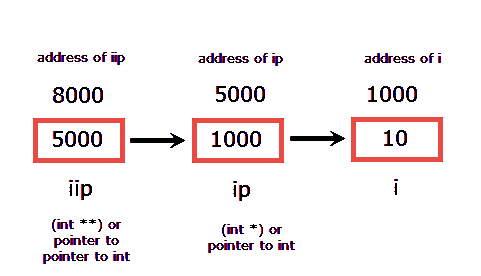

# C 语言中的指针算法

> 原文:[https://overiq . com/c-programming-101/指针-算术-in-c/](https://overiq.com/c-programming-101/pointer-arithmetic-in-c/)

最后更新于 2020 年 9 月 24 日

* * *

现在你应该知道指针只不过是一个用来存储内存地址的变量。如果这对你来说仍然是新闻，那么在继续本章之前，回去阅读[指针基础知识](https://overiq.com/c-programming-101/pointer-basics-in-c/)。

在本章中，我们将讨论可以对指针执行的算术运算。

我们不能用指针执行所有类型的算术运算。指针算术与我们日常生活中通常使用的算术略有不同。适用于指针的唯一有效算术运算是:

1.  向指针添加整数
2.  指针的整数减法
3.  减去两个相同类型的指针

指针算术是相对于指针的基本类型执行的。例如，如果我们有一个包含地址`1000`的整数指针`ip`，那么将其递增`1`，我们将得到`1004`(即`1000 + 1 * 4`)而不是`1001`，因为`int`数据类型的大小是`4`字节。如果我们使用的系统中`int`的大小是`2`字节，那么我们会得到`1002`(即`1000 + 1 * 2`)。

同样，递减它，我们将得到`996`(即`1000 - 1 * 4`)而不是`999`。

所以，表达式`ip + 4`将指向地址`1016`(即`1000 + 4 * 4`)。

我们再举几个例子。

```
int i = 12, *ip = &i;
double d = 2.3, *dp = &d;
char ch = 'a', *cp = &ch;

```

假设`i`、`d`、`ch`的地址分别为`1000`、`2000`、`3000`，因此`ip`、`dp`、`cp`最初位于`1000`、`2000`、`3000`。

## 整数上的指针算法

| 指针表达式 | 如何评价？ |
| --- | --- |
| `ip = ip + 1` | `ip` = > `ip + 1` = > `1000 + 1*4` = > `1004` |
| `ip++`或`++ip` | `ip++` = > `ip + 1` = > `1004 + 1*4` = > `1008` |
| `ip = ip + 5` | `ip` = > `ip + 5` = > `1008 + 5*4` = > `1028` |
| `ip = ip - 2` | `ip` = > `ip - 2` = > `1028 - 2*4` = > `1020` |
| `ip--`或`--ip` | `ip` = > `ip + 2` = > `1020 + 2*4` = > `1028` |

## 浮点指针算法

| 指针表达式 | 如何评价？ |
| --- | --- |
| `dp + 1` | `dp = dp + 1`=>T1】=>T2】 |
| `dp++`或`++dp` | `dp++` = > `dp+1` = > `2008+1*8` = > `2016` |
| `dp = dp + 5` | `dp` = > `dp + 5` = > `2016+5*8` = > `2056` |
| `dp = dp - 2` | `dp` = > `dp - 2` = > `2056-2*8` = > `2040` |
| `dp--`或`--dp` | DP = > DP-1`=>`2040-1 * 8`=>`2032’ |

## 字符上的指针算法

| 指针表达式 | 如何评价？ |
| --- | --- |
| `cp + 1` | `cp = cp + 1`=>T1】=>T2】 |
| `cp++`或`++cp` | `cp` = > `cp + 1` = > `3001 + 1*1` = > `3002` |
| `cp = cp + 5` | `cp` = > `cp + 5` = > `3002 + 5*1` = > `3007` |
| `cp = cp - 2` | `cp` = > `cp + 5` = > `3007 - 2*1` = > `3005` |
| `cp--`或`--cp` | `cp` = > `cp + 2` = > `3005 - 1*1` = > `3004` |

**注意:**当我们使用指针算法递增或递减指针变量时，变量`i`、`d`、`ch`的地址不会受到任何影响。

对类型`char`的算术运算看似普通的算术运算，因为`char`类型的大小是`1`字节。另一个需要注意的要点是，当我们通过增加或减少数字来增加或减少指针变量时，指针变量不必仍然指向有效的内存位置。所以，我们在这样移动指针的时候，一定要特别注意。通常，我们对数组使用指针算法，因为数组的元素排列在连续的内存位置，这将在下一章中详细讨论。

下面的程序展示了指针算法。

```
#include<stdio.h>

int main()
{
    int i = 12, *ip = &i;
    double d = 2.3, *dp = &d;
    char ch = 'a', *cp = &ch;

    printf("Value of ip = %u\n", ip);
    printf("Value of dp = %u\n", dp);
    printf("Value of cp = %u\n\n", cp);

    printf("Value of ip + 1 = %u\n", ip + 1);
    printf("Value of dp + 1 = %u\n", dp + 1);
    printf("Value of cp + 1 = %u\n\n", cp + 1);

    printf("Value of ip + 2 = %u\n", ip + 2);
    printf("Value of dp + 2 = %u\n", dp + 2);
    printf("Value of cp + 2 = %u\n", cp + 2);

    return 0;
}

```

[现在试试](https://overiq.com/c-online-compiler/M9B/)

**预期输出:**

```
Value of ip = 2293316
Value of dp = 2293304
Value of cp = 2293303

Value of ip + 1 = 2293320
Value of dp + 1 = 2293312
Value of cp + 1 = 2293304

Value of ip + 2 = 2293324
Value of dp + 2 = 2293320
Value of cp + 2 = 2293305

```

## 两个指针之间的指针算法

如果我们有两个基类型指针`p1`和`p2`分别指向地址为`1000`和`1016`的`int`，那么`p2 - p1`将给出`4`，因为`int`类型的大小是`4`字节。如果从`p1`即`p1 - p2`中减去`p2`，那么答案将是否定的，即`-4`。

下面的程序演示了相同类型的两个指针之间的指针算法。

```
#include<stdio.h>

int main()
{
    int i1 = 12, *ip1 = &i1;
    int i2 = 12, *ip2 = &i2;

    printf("Value of ip1 or address of i1 = %u\n", ip1);
    printf("Value of ip2 or address of i2 = %u\n\n", ip2);

    printf("ip2 - ip1 = %d\n", ip1 - ip2);
    printf("ip1 - ip2 = %d\n", ip2 - ip1);

    // signal to operating system program ran fine
    return 0;
}

```

[现在试试](https://overiq.com/c-online-compiler/N8K/)

**预期输出:**

```
Value of ip1 or address of i1 = 2686788
Value of ip2 or address of i2 = 2686780

ip2 - ip1 = 2
ip1 - ip2 = -2

```

## 组合间接运算符(*)和递增/递减运算符

在处理数组元素时(正如您将在下一章中看到的)，C 程序员经常混合使用间接运算符(`*`)和递增/递减运算符(`++`和`--`)。

请始终记住，间接运算符(`*`)和递增/递减运算符的优先级是相同的，并且它们是从右向左关联的(参见中的[运算符优先级和关联性)。](/c-programming-101/operator-precedence-and-associativity-in-c/)

假设`x`是整数变量，`p`是指向`int`的指针。现在考虑以下陈述，并尝试解释它们。

**例 1:**

```
x = *p++;

```

由于`*`和`++`操作符具有相同的优先级，从右向左关联`++`将应用于`p`，而不是`*p`。因为递增运算符是后缀，所以表达式中首先使用`p`的值，然后它将递增。因此`p`指向的第一个整数将被取消引用并分配给`x`，然后`p`的值将增加`1`。

**例 2:**

```
x = ++*p;

```

这里`*`运算符首先应用于`p`，然后`++`应用于`*p`。因此，第一个整数指针被取消引用，从取消引用中获得的值递增，并最终分配给`x`。

**例 3:**

```
x = *++p;

```

`++`运算符有前缀，因此首先，`p`将递增，然后新地址的值被取消引用并分配给`x`。

**注意:**如果你还有什么疑惑，可以随时用`()`围绕你想先评估的表情。

## 指针比较

可以使用带指针的关系运算符(`<`、`<=`、`>`、`>=`、`==`、`!=`)。`==`和`!=`运算符用于比较两个指针是否包含相同的地址。当两个指针都为 null 或包含同一变量的地址时，它们是相等的。这些(即`==`和`!=`)运算符的使用仅在指针属于相同的基类型时有效，或者在空指针和任何其他指针之间有效，或者在空指针(将在后面讨论)和任何其他指针之间有效。只有当两个指针都指向同一个数组的元素时，使用其他关系运算符(`<`、`<=`、`>`、`>=`)来比较两个指针才有意义。

## 指针指向指针

我们知道指针是一个包含内存地址的变量。指针变量本身在内存中占据一些空间，因此它也有一个内存地址。我们可以将指针变量的地址存储在其他变量中，这就是所谓的指针对指针。将指针声明为指针的语法如下:

**语法:** `data_type **p;`

让我们举个例子:

```
int i = 10;
int *ip = &i;
int **iip = &ip;

```

这里`ip`是类型`(int *)`或者指向`int`的指针，`iip`是类型`(int **)`或者指向`int`的指针。



我们知道`*ip`将给出地址`ip`的值，即`i`的值。你能猜到`**iip`会返回什么值吗？

```
**iip

```

我们知道间接运算符是从右向左计算的，因此`**iip`也可以写成

```
*(*iip)

```

`*iip`指地址`iip`的值或存储在`ip`的地址。在取消引用存储在`ip`的地址时，我们将获得存储在变量`i`中的值。

```
*(*iip)
=> *ip
=> i

```

因此`**iip`给出存储在变量`i`中的值。

下面的程序演示了如何在`int`中使用指针对指针。

```
#include<stdio.h>

int main()
{
    int i = 10;
    int *ip = &i;
    int **iip = &ip;

    printf("Value of i = %d\n\n", i);

    printf("Address of i = %u\n", &i);
    printf("Value of ip = %d\n\n", ip);

    printf("Address of ip = %u\n", &ip);
    printf("Value of iip = %d\n\n", iip);

    printf("Value of *iip = value of ip = %d\n", *iip);
    printf("Value of **iip = value of i = %d\n\n", **iip);

    return 0;
}

```

[现在试试](https://overiq.com/c-online-compiler/OZG/)

**预期输出:**

```
Value of i = 10

Address of i = 2293332
Value of ip = 2293332

Address of ip = 2293320
Value of iip = 2293320

Value of *iip = value of ip = 2293332
Value of **iip = value of i = 10

```

* * *

* * *