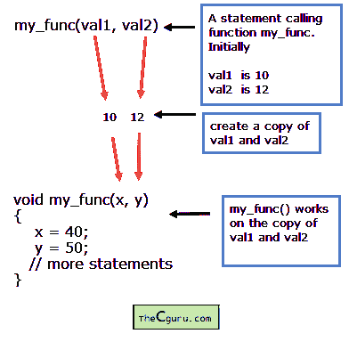

# C 语言中的值调用和引用调用

> 原文:[https://overiq . com/c-programming-101/按值调用和按引用调用 in-c/](https://overiq.com/c-programming-101/call-by-value-and-call-by-reference-in-c/)

最后更新于 2020 年 7 月 27 日

* * *

c 提供了两种向函数传递参数的方式。

1.  按值调用或按值传递。
2.  通过引用调用。

让我们从“价值召唤”开始。

## 按值调用

在这种方法中，首先复制每个实际参数，然后将这些值分配给相应的形式参数。



这意味着被调用函数所做的更改不会影响调用函数中实际参数的值。在上图所示的示例中，`my_func()`函数修改了`val1`和`val2`值的副本。但是`val1`和`val2`的原值不变。

到目前为止，我们编写的所有函数都使用按值调用，除了我们向函数传递数组的函数。

## 引用调用

在这种方法中，实际参数的地址被复制，然后分配给相应的形式参数。现在，形式参数和实际参数都指向相同的数据(因为它们包含相同的地址)。因此，被调用函数所做的任何更改也会影响实际参数。

让我们举一些例子:

以下程序演示了按值调用:

```
#include<stdio.h>
void try_to_change(int, int);

int main()
{
    int x = 10, y = 20;

    printf("Initial value of x = %d\n", x);
    printf("Initial value of y = %d\n", y);

    printf("\nCalling the function\n");

    try_to_change(x, y);

    printf("\nValues after function call\n\n");

    printf("Final value of x = %d\n", x);
    printf("Final value of y = %d\n", y);

    // signal to operating system program ran fine
    return 0;
}

void try_to_change(int x, int y)
{
    x = x + 10;
    y = y + 10;

    printf("\nValue of x (inside function) = %d\n", x);
    printf("Value of y (inside function) = %d\n", y);
}

```

**预期输出:**

```
Initial value of x = 10
Initial value of y = 20

Value of x (inside function) = 20
Value of y (inside function) = 30

Values after function call

Final value of x = 10
Final value of y = 20

```

**工作原理:**

函数`main()`内部的变量`x`和`y`与函数`try_to_change()`形式自变量中的变量`x`和`y`完全不同。第 13 行，调用`try_to_change()`函数时，复制`x`和`y`的值，并将该副本传递给函数`try_to_change()`的形式参数`x`和`y`。在函数`try_to_change()`中，我们试图通过为其分配新值来更改`x`和`y`的原始值。由于`try_to_change()`正在处理`x`和`y`的副本，因此`try_to_change()`函数所做的更改不会对实际参数`x`和`y`产生影响。

要使用引用调用，我们需要做两件事:

1.  传递实际参数的地址，而不是将值传递给函数。
2.  将函数的形式参数声明为适当类型的指针变量。

下面的程序演示了引用调用。

```
#include<stdio.h>
void try_to_change(int *, int *);

int main()
{
    int x = 10, y = 20;

    printf("Initial value of x = %d\n", x);
    printf("Initial value of y = %d\n", y);

    printf("\nCalling the function\n");

    try_to_change(&x, &y);

    printf("\nValues after function call\n\n");

    printf("Final value of x = %d\n", x);
    printf("Final value of y = %d\n", y);

    // signal to operating system everything works fine
    return 0;
}

void try_to_change(int *x, int *y)
{
    (*x)++;
    (*y)++;

    printf("\nValue of x (inside function) = %d\n", *x);
    printf("Value of y (inside function) = %d\n", *y);
}

```

**预期输出:**

```
Initial value of x = 10
Initial value of y = 20

Calling the function

Value of x (inside function) = 11
Value of y (inside function) = 21

Values after function call

Final value of x = 11
Final value of y = 21

```

这里我们将整数变量的地址传递给一个函数。所以形式参数必须声明为指向`int`或`(int *)`的指针。表达式`(*x)++`意味着首先在`x`取消引用该值，然后增加它。类似地，`(*y)++`意味着首先在`y`取消引用该值，然后增加它。当功能`try_to_change()`结束时，控制返回到第 17 行和第 18 行的`main()`和`printf()`语句，分别打印`x`和`y`的新值。

* * *

* * *