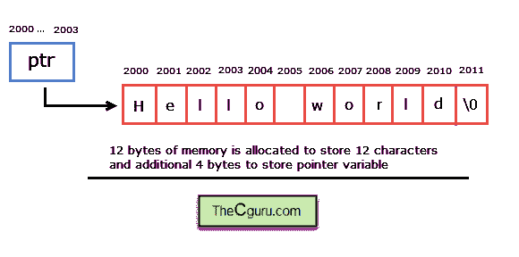
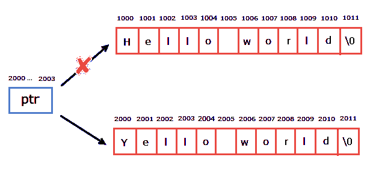

# C 语言中的字符数组和字符指针

> 原文:[https://overiq . com/c-programming-101/字符-数组-字符-指针-in-c/](https://overiq.com/c-programming-101/character-array-and-character-pointer-in-c/)

最后更新于 2020 年 7 月 27 日

* * *

在本章中，我们将研究字符数组和字符指针之间的区别。考虑以下示例:

```py
char arr[] = "Hello World"; // array version
char ptr* = "Hello World";  // pointer version

```

你能指出它们之间的相似之处或不同之处吗？

相似之处在于:

这两个变量的类型都是指向`char`或`(char*)`的指针，因此您可以将它们中的任何一个传递给其形式参数接受字符数组或字符指针的函数。

以下是不同之处:

1.  `arr`是`12`字符的数组。当编译器看到以下语句时:

    ```py
    char arr[] = "Hello World";

    ```

    它分配`12`个连续字节的内存，并将第一个分配字节的地址与`arr`相关联。
    T3】

    另一方面，当编译器看到语句时。

    ```py
    char ptr* = "Hello World";

    ```

    它为字符串文字`"Hello World"`分配`12`连续字节，为指针变量`ptr`分配`4`额外字节。并将字符串文字的地址分配给`ptr`。所以，在这种情况下，总共分配了`16`个字节。

    

2.  我们已经了解到数组的名称是一个常量指针。所以如果`arr`指向地址`2000`，在程序结束前它会一直指向地址`2000`，我们无法更改它的地址。这意味着字符串赋值对于定义为数组的字符串无效。

    ```py
    arr = "Yellow World"; // Wrong

    ```

    相反，`ptr`是一个类型为`char`的指针变量，所以可以取任何其他地址。作为结果字符串，赋值对指针有效。

    ```py
    ptr = "Yellow World"; // ok

    ```

    

    上述赋值后，`ptr`指向存储在内存某处的`"Yellow World"`的地址。

    显然，问题出现了，那么我们如何给`arr`分配不同的字符串呢？

    我们可以通过使用`gets()`、`scanf()`、`strcpy()`或者通过逐个分配字符来为`arr`分配一个新字符串。

    ```py
    gets(arr);
    scanf("%s", arr);
    strcpy(arr, "new string");
    arr[0] = 'R';
    arr[1] = 'e';
    arr[2] = 'd';
    arr[3] = ' ';
    arr[4] = 'D';
    arr[5] = 'r';
    arr[6] = 'a';
    arr[7] = 'g';
    arr[8] = 'o';
    arr[9] = 'n';

    ```

3.  回想一下，修改字符串文字会导致未定义的行为，因此以下操作无效。

    ```py
    char *ptr = "Hello";
    ptr[0] = 'Y'; or *ptr = 'Y';
    gets(name);
    scanf("%s", ptr);
    strcpy(ptr, "source");
    strcat(ptr, "second string");

    ```

4.  使用未初始化的指针也可能导致未定义的行为。

    ```py
    char *ptr;

    ```

    这里`ptr`是未初始化的一个包含垃圾的值。所以下面的操作是无效的。

    ```py
    ptr[0] = 'H';
    gets(ptr);
    scanf("%s", ptr);
    strcpy(ptr, "source");
    strcat(ptr, "second string");

    ```

    只有当`ptr`指向一个有效的内存位置时，我们才能使用它。

    ```py
    char str[10];
    char *p = str;

    ```

    现在上面提到的所有操作都有效。我们可以使用 ptr 的另一种方法是使用`malloc()`或`calloc()`函数动态分配内存。

    ```py
    char *ptr;
    ptr = (char*)malloc(10*sizeof(char)); // allocate memory to store 10 characters

    ```

    让我们通过创建动态的一维字符数组来结束这一章。

```py
#include<stdio.h>
#include<stdlib.h>

int main()
{
    int n, i;
    char *ptr;

    printf("Enter number of characters to store: ");
    scanf("%d", &n);

    ptr = (char*)malloc(n*sizeof(char));

    for(i=0; i < n; i++)
    {
        printf("Enter ptr[%d]: ", i);
        /* notice the space preceding %c is
          necessary to read all whitespace in the input buffer
        */
        scanf(" %c", ptr+i); 
    }

    printf("\nPrinting elements of 1-D array: \n\n");

    for(i = 0; i < n; i++)
    {
        printf("%c ", ptr[i]);
    }

    // signal to operating system program ran fine
    return 0;
}

```

**预期输出:**

```py
Enter number of characters to store: 6
Enter ptr[0]: a
Enter ptr[1]: b
Enter ptr[2]: c
Enter ptr[3]: d
Enter ptr[4]: y
Enter ptr[5]: z

Printing elements of 1-D array:

a b c d y z

```

* * *

* * *