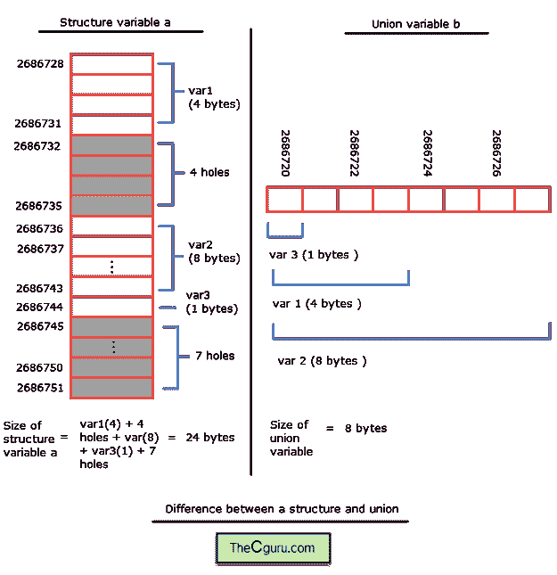

# C 语言中的联合基础

> 原文:[https://overiq.com/c-programming-101/union-basics-in-c/](https://overiq.com/c-programming-101/union-basics-in-c/)

最后更新于 2020 年 7 月 27 日

* * *

假设您正在创建一个程序来记录不同商品的名称和数量，其中数量可能是计数、重量或体积。解决这个问题的一种方法是创建如下结构:

```
struct goods
{
    char name[20];
    int count;
    float weight;
    float volume;
};

struct goods balls = {"balls", 10};

```

众所周知，球的数量是用计数来衡量的。所以，在这种情况下，不需要重量和体积。

同样在下面的陈述中:

```
struct goods flour = {"balls", 0, "20"};

```

因为面粉的数量是用重量来衡量的。所以，在这种情况下，不需要存储计数和体积。

从这些观察中，我们可以得出结论，一个特定类型的商品一次只能用数量中的一个来衡量，要么是数量，要么是重量，要么是体积。

在这一点上，我们的计划有以下限制:

*   它占用的空间比要求的多，因此效率较低。
*   有人可能设置了多个值。

如果我们可以用计数、重量或体积来记录数量，那就更有用了。这样我们可以节省很多内存。

在 C 语言中，联合允许我们这样做。

## 什么是工会？

像结构一样，联合用于创建新的数据类型。它也可以像结构一样包含成员。定义联合、创建联合变量和访问联合成员的语法与结构相同，唯一的区别是使用了联合关键字而不是结构。

结构和联合之间的重要区别在于，在结构中，每个成员都有自己的记忆，而联合中的成员共享相同的记忆。当声明类型为 union 的变量时，编译器会分配足够的内存来容纳 union 的最大成员。由于所有成员共享相同的内存，所以一次只能使用联合的一个成员，因此联合用于节省内存。声明联合的语法如下:

**语法:**

```
union tagname
{
    data_type member_1;
    data_type member_2;
    data_type member_3;
    ...
    data_type member_N;
};

```

就像结构一样，您可以用 union 定义或单独声明 union 变量。

```
union tagname
{
    data_type member_1;
    data_type member_2;
    data_type member_3;
    ... 
    data_type member_N;
} var_union;

union tagname var_union_2;

```

如果我们有一个联合变量，那么我们可以使用点运算符(`.`)访问联合的成员，同样，如果我们有指向联合的指针，那么我们可以使用箭头运算符(`->`)访问联合的成员。

下面的程序演示了如何使用联合。

```
#include<stdio.h>

/*
union is defined above all functions so it is global.
*/

union data
{
    int var1;
    double var2;
    char var3;
};

int main()
{
    union data t;

    t.var1 = 10;
    printf("t.var1 = %d\n", t.var1);

    t.var2 = 20.34;
    printf("t.var2 = %f\n", t.var2);

    t.var3 = 'a';
    printf("t.var3 = %c\n", t.var3);

    printf("\nSize of structure: %d", sizeof(t));

    return 0;
}

```

**预期输出:**

```
t.var1 = 10
t.var2 = 20.340000
t.var3 = a

Size of structure: 8

```

**工作原理:**

在第 7-12 行中，宣布了一个有三个成员的联盟`data`，即`int`类型的`var1`、`double`类型的`var2`和`char`类型的`var3`。当编译器看到联合的定义时，它将分配足够的内存来容纳联合的最大成员。在这种情况下，最大的成员是`double`，所以它将分配`8`字节的内存。如果上面的定义被声明为一个结构，编译器会分配`13`字节(`8+4+2`)的内存(这里我们忽略了漏洞，点击这里了解更多信息)。

在第 16 行，声明了类型为`union data`的联合变量`t`。

在第 18 行中，`t`的第一个成员，即`var1`用值`10`初始化。需要注意的重要一点是，此时另外两个成员包含垃圾值。

在第 19 行中，`t.var1`的值是使用`printf()`语句打印的。

在第 21 行中，`t`的第二个成员，即`var2`被赋值为`20.34`。此时，另外两个成员包含垃圾值。

在第 22 行中，使用`printf()`语句打印`t.var2`的值。

在第 24 行中，`t`的第三个成员，即`var3`被赋值为`'a'`。此时，另外两个成员包含垃圾值。

在第 25 行中，使用`printf()`语句打印`t.var3`的值。

在第 27 行中，`sizeof()`运算符用于打印工会的大小。因为我们知道，在联合的情况下，编译器分配足够的内存来容纳最大的成员。联合`data`的最大成员是`var2`，因此`sizeof()`运算符返回`8`字节，然后使用`printf()`语句打印该字节。

## 初始化联合变量

在上面的程序中，我们已经看到了如何初始化联合变量的单个成员。我们也可以在声明时初始化 union 变量，但是有一个限制。由于联合共享相同的内存，所有成员不能同时持有这些值。所以我们只能在声明时初始化联盟的一个成员，这个特权属于第一个成员。例如:

```
union data
{
    int var1;
    double var2;
    char var3;
};

union data j = {10};

```

该语句初始化联合变量`j`，或者换句话说，它只初始化联合变量`j`的第一个成员。

## 指定的初始值设定项

指定的初始值设定项允许我们设置一个成员的值，而不是联合的第一个成员。假设我们要在声明时初始化工会数据的`var2`成员。我们可以这样做。

```
union data k = {.var2 = 9.14 };

```

这将把`var2`的值设置为`9.14`。同样，我们可以在声明时初始化第三个成员的值。

```
union data k = { .var3 = 'a' };

```

下面的程序演示了结构和指针之间的区别。

```
#include<stdio.h>
/*
union is defined above all functions so it is global.
*/

struct s
{
    int var1;
    double var2;
    char var3;
};

union u
{
    int var1;
    double var2;
    char var3;
};

int main()
{
    struct s a;
    union u b;

    printf("Information about structure variable \n\n");

    printf("Address variable of a = %u\n", &a);
    printf("Size of variable of a = %d\n", sizeof(a));

    printf("Address of 1st member i.e var1 = %u\n", &a.var1);
    printf("Address of 2nd member i.e var2 = %u\n", &a.var2);
    printf("Address of 3rd member i.e var3 = %u\n", &a.var3);

    printf("\n");

    printf("Information about union variable \n\n");

    printf("Address of variable of b = %u\n", &b);
    printf("Size of variable of b = %d\n", sizeof(b));

    printf("Address of 1st member i.e var1 = %u\n", &b.var1);
    printf("Address of 2nd member i.e var2 = %u\n", &b.var2);
    printf("Address of 3rd member i.e var3 = %u\n", &b.var3);
    printf("\n\n");

    return 0;
}

```

**预期输出:**

```
Address variable of a = 2686728
Size of variable of a = 24
Address of 1st member i.e var1 = 2686728
Address of 2nd member i.e var2 = 2686736
Address of 3rd member i.e var3 = 2686744

Information about union variable

Address of variable of b = 2686720
Size of variable of b = 8
Address of 1st member i.e var1 = 2686720
Address of 2nd member i.e var2 = 2686720
Address of 3rd member i.e var3 = 2686720

```

**工作原理:**

在第 6-11 行中，类型为`s`的结构由三个成员声明，即类型为`int`的`var1`、`float`的`var2`和类型为`char`的`var3`。

在第 13-18 行中，类型为`u`的联合声明有三个成员，即类型为`int`的`var1`、`float`的`var2`和类型为`char`的`var3`。

第 22 行和第 23 行分别声明了类型为`struct s`的结构变量`a`和类型为`union u`的联合变量`b`。

在第 27 行，使用`&`运算符打印结构变量`a`的地址。

在第 28 行，使用`sizeof()`运算符打印结构变量的大小。

类似地，第 38 行和第 39 行的`printf()`语句分别打印联合变量`b`的地址和大小。

工会的所有成员共享相同的内存，这就是为什么接下来的三个`printf()`语句打印相同的地址。



请注意，联盟的成员共享相同的地址，而结构的成员不共享。结构和联合变量大小的差异也表明，在某些情况下，联合可以提供更经济的内存使用。我想强调的另一个要点是，由于前面讨论的边界对齐，结构的大小可能大于成员的总和，工会也是如此。

一个结构可以是联盟的成员。类似地，联合可以是结构的成员。

现在让我们把注意力转移回我们在引入工会时讨论的问题。

在了解了联合之后，我们知道一次只有联合变量的一个成员可用，这意味着联合是定义数量的完美选择。因此，如果将不同的数量存储为结构的成员，为什么不创建一个数量联盟，这样，对于任何商品，联盟中只有一个成员可用。

```
struct goods
{
    char name[20];

    union quantity
    {
        int count;
        float weight;
        float volume;
    } quant;
} g;

```

我们可以在商品结构之外定义联合数量，而不是嵌套数量。

```
union quantity
{
    int count;
    float weight;
    float volume;
};

struct goods
{
    char name[20];
    union quantity quant;
} g;

```

如果我们想访问 count 的值，我们可以写:

```
g.quant.count

```

类似地，为了获得权重值，我们可以写:

```
g.quant.weight

```

下面的程序演示了如何使用联合作为结构的成员。

```
#include<stdio.h>

/*
union is defined above all functions so it is global.
*/

union quantity
{
    int count;
    float weight;
    float volume;
};

struct goods
{
    char name[20];
    union quantity q;
};

int main()
{
    struct goods g1 = { "apple", {.weight=2.5} };
    struct goods g2 = { "balls", {.count=100} };

    printf("Goods name: %s\n", g1.name);
    printf("Goods quantity: %.2f\n\n", g1.q.weight);

    printf("Goods name: %s\n", g2.name);
    printf("Goods quantity: %d\n\n", g2.q.count);

    return 0;
}

```

**预期输出:**

```
Goods name: apple
Goods quantity: 2.50

Goods name: balls
Goods quantity: 100

```

**工作原理:**

在第 7-12 行中，宣布了一个有三个成员的联盟`quantity`，即`int`类型的`count`、`float`类型的`weight`和`float`类型的`volume`。

在第 14-18 行中，结构`goods`用`2`成员声明，即由字符组成的名称和类型`union`数量的`w`。

在第 22 行，结构变量`g1`被声明和初始化。重要的是要注意如何使用指定的初始化器来初始化联合的`weight`成员。如果我们想要初始化第一个元素，我们应该这样做:

```
struct goods g1 = { "apple", {112} };

```

或者

```
struct goods g1 = { "apple", 112 };

```

在第 23 行，结构变量`g2`被声明和初始化。

在第 25 行和第 26 行，第一批货物的`name`和`weight`使用`printf()`语句打印。

类似地，在第 28 行和第 29 行中，第二货的`name`和`weight`使用`printf()`语句打印。

* * *

* * *