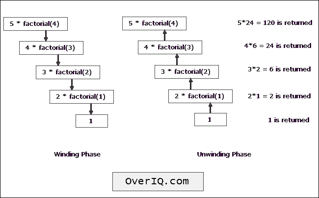

# 使用递归计算阶乘的 C 程序

> 原文：<https://overiq.com/c-examples/c-program-to-calculate-factorial-using-recursion/>

最后更新于 2020 年 9 月 24 日

* * *

下面是一个使用递归计算阶乘的 C 程序:

```c
/**************************************************
 Program to calculate Factorial using recursion 
 * 
 * Enter a number: 4
 * 4! = 24
 ***************************************************/

#include<stdio.h> // include stdio.h library
long factorial(int num);

int main(void)
{    
    int n;

    printf("Enter a number: ");
    scanf("%d", &n);

    printf("%d! = %ld", n, factorial(n));

    return 0; // return 0 to operating system
}

long factorial(int num)
{    

    //base condition
    if(num == 0)
    {
        return 1;
    }

    else
    {
        // recursive call
        return num * factorial(num -  1);
    }

}

```

[现在试试](https://overiq.com/c-online-compiler/2WP/)

**预期输出:**

第一次运行:

```c
Enter a number: 0
0! = 1

```

第二次运行:

```c
Enter a number: 5
5! = 120

```

## 它是如何工作的

下图演示了`5!`的评估是如何进行的:



* * *

* * *