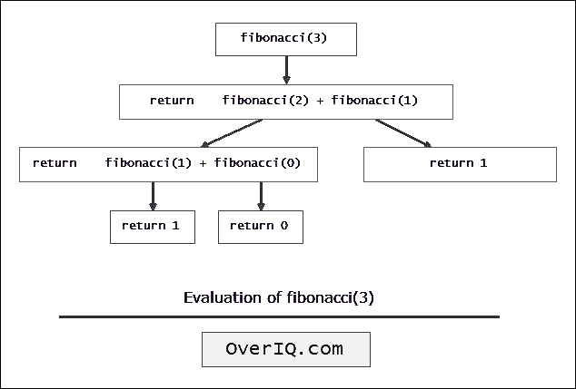

# 用递归打印斐波那契数列的 c 程序

> 原文:[https://overiq . com/c-examples/c-程序到打印-斐波那契-序列-使用-递归/](https://overiq.com/c-examples/c-program-to-print-fibonacci-sequence-using-recursion/)

最后更新于 2020 年 9 月 24 日

* * *

下面是一个用递归打印斐波那契数列的 C 程序:

```
/****************************************************
 Program to print Fibonacci Sequence using recursion 
 * 
 * Enter terms: 10
 * 0 1 1 2 3 5 8 13 21 34 
 ****************************************************/

#include<stdio.h> // include stdio.h library
int fibonacci(int);

int main(void)
{    
    int terms;

    printf("Enter terms: ");
    scanf("%d", &terms);       

    for(int n = 0; n < terms; n++)
    {
        printf("%d ", fibonacci(n));
    }

    return 0; // return 0 to operating system
}

int fibonacci(int num)
{    

    //base condition
    if(num == 0 || num == 1)
    {
        return num;
    }

    else
    {
        // recursive call
        return fibonacci(num-1) + fibonacci(num-2);
    }

}

```

[现在试试](https://overiq.com/c-online-compiler/j8z/)

**预期输出:**

```
Enter terms: 20
0 1 1 2 3 5 8 13 21 34 55 89 144 233 377 610 987 1597 2584 4181

```

## 它是如何工作的

下图显示了`fibonacci(3)`的评估是如何进行的:



* * *

**推荐阅读:**

*   [使用递归计算阶乘的 C 程序](/c-examples/c-program-to-calculate-factorial-using-recursion/)
*   [使用递归计算功率的 C 程序](/c-examples/c-program-to-calculate-the-power-using-recursion/)

* * *

* * *