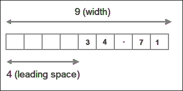
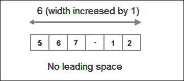
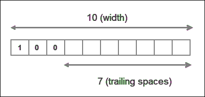

# Python 中的数字

> 原文:[https://overiq.com/python-101/numbers-in-python/](https://overiq.com/python-101/numbers-in-python/)

最后更新于 2020 年 9 月 17 日

* * *

## Python 中的数字

在 Python 中，数字有 4 种类型:

1.  整数。
2.  浮点或实数。
3.  复数。
4.  布尔型。

整数或简称`int`是没有小数点的数字。比如`100`、`77`、`-992`是`int`但是`0.56`、`-4.12`、`2.0`不是。

浮点或实数或`float`是有小数点的数字。比如`1.2`、`0.21`、`-99.0`是浮动的而`102`、`-8`不是。我们也可以用科学记数法写浮点数。以`a x 10^b`形式书写的数字被称为科学符号。科学符号对于写非常小或非常大的数字非常有用。例如，float `0.000000123`在科学记数法中可以简洁地写成`1.23 x 10^-7`。Python 使用一种特殊的语法来用科学符号写数字。比如`0.000000123`可以写成`1.23E-7`。字母`E`叫指数，用`e`还是`E`都无所谓。

复数是我们不能在一条数字线上表示的数字。复数的形式是`a + ib`，其中`a`是实部，`bi`是虚部。比如`2 + 3i`是复数。Python 对复数也使用特殊的语法。尾随的整数或浮点数`j`在 Python 中被视为复数，因此`10j`、`9.12j`都是复数。

```py
>>>
>>> type(5)   # an integer
<class 'int'>
>>>
>>> type(3.4)  # a float
<class 'float'>
>>>
>>> type(5j)  # a complex number
<class 'complex'>
>>>

```

[现在试试](https://overiq.com/python-online-compiler/J2/)

注意`5j`只代表复数的虚部。要创建一个有实部和虚部的复数，只需在虚部上加上一个数字。比如复数`2 + 3i`可以用 Python 写成`2 + 3j`。

布尔类型将在本章后面讨论。

## 常见的数学函数

Python 提供了以下内置函数来帮助您完成常见的编程任务:

| 功能 | 它有什么作用？ | 例子 |
| --- | --- | --- |
| `abs(number)` | 返回数字的绝对值。换句话说，`abs()`函数只是返回没有任何符号的数字。 | `abs(-12)`是`12`，`abs(112.21)`是`112.21`。 |
| `pow(a, b)` | 返回`a^b`。 | `pow(2, 3)`是`8`，`pow(10, 3)`是`1000` |
| `round(number)` | 将数字舍入到最接近的整数。 | `round(17.3)`是`17`，`round(8.6)`是`9` |
| `round(number, ndigits)` | 小数点后将`number`舍入到`ndigits` | `round(3.14159, 2)`是`3.14`，`round(2.71828, 2)`是`2.72` |
| `min(arg1, arg2, ... argN)` | 返回`arg1`、`arg2`中最小的项目，...`argN` | `min(12, 2, 44, 199)`是`2`，`min(4, -21, -99)`是`-99` |
| `max(arg1, arg2, ... argN)` | 返回`arg1`、`arg2`中最大的项目，...`argN` | `max(991, 22, 19)`是`991`，`max(-2, -1, -5)`是`-1` |

### abs()功能

```py
>>>
>>> abs(-100)      # absolute value of -100
100
>>>
>>> abs(291.121)   # absolute value of 291.121
291.121
>>>
>>> abs(88)        # absolute value of 88
88
>>>

```

[现在试试](https://overiq.com/python-online-compiler/KR/)

### power()函数

```py
>>>
>>> pow(3, 3)           # calculate 3^3
27
>>>
>>> pow(0.35, 2)        # calculate 0.35^2
0.12249999999999998
>>>
>>> pow(9, -2)          # calculate 9^-2
0.012345679012345678
>>>

```

[现在试试](https://overiq.com/python-online-compiler/Lw/)

### round()函数

```py
>>>
>>> round(32.3)         # round 32.3 to the nearest integer
32
>>> round(99.7)         # round 99.7 to the nearest integer
100
>>> round(-5.23)        # round -5.23 to the nearest integer
-5
>>>
>>> round(3.14159, 2)   # round 3.14159 to 2 decimal places
3.14
>>>
>>> round(2.71828, 3)   # round 2.71828 to 3 decimal places
2.718
>>>

```

[现在试试](https://overiq.com/python-online-compiler/MA/)

### 最大()和最小()函数

```py
>>>
>>> max(1, 4, 100)      # Find the largest among 1, 4 and 100
100
>>>
>>> max(-21, 4.5, 91.12)   # Find the largest among -21, 4.5 and 91.12
91.12
>>>
>>> max(-67, -17, 0)        # Find the largest among -67, 417 and 0
0
>>>
>>> min(0, -1.23e10, -9921)  # Find the smallest among 0, -1.23e10 and -9921
-12300000000.0
>>>
>>>
>>> min(92, 6, -102)     # Find the largest among 92, 6, -102
-102
>>>

```

[现在试试](https://overiq.com/python-online-compiler/N6/)

Python 的`math`模块也提供了一些标准的数学函数和常量。回想一下，要使用数学模块，我们首先需要使用`import`语句导入它，如下所示:

```py
import math

```

下表列出了`math`模块中的一些标准数学函数和常数。

| 功能 | 它有什么作用？ | 例子 |
| --- | --- | --- |
| `math.pi` | 返回`pi`的值 | `math.pi`是`3.141592653589793` |
| `math.e` | 返回`e`的值 | `math.e`是`2.718281828459045` |
| `math.ceil(n)` | 返回大于或等于`n`的最小整数 | `math.ceil(3.621)`是`4` |
| `math.floor(n)` | 返回小于或等于`n`的最大整数 | `math.floor(3.621)`是`3` |
| `math.fabs(n)` | 将`x`的绝对值返回为`float` | `math.fabs(5)`是`5.0` |
| `math.sqrt(n)` | 以浮点形式返回 x 的平方根 | `math.sqrt(225)`是`15.0` |
| `math.log(n)` | 将`n`的自然对数返回到基数`e` | `math.log(2)`是`0.6931` |
| `math.log(n, base)` | 将`n`的日志返回给定的基数 | `math.log(2, 2)`是`1.0` |
| `math.sin(n)` | 返回`n`弧度的正弦值 | `math.sin(math.pi/2)`是`1.0` |
| `math.cos(n)` | 返回`n`弧度的余弦值 | `math.cos(0)`是`1.0` |
| `math.tan(n)` | 返回`n`弧度的正切值 | `math.tan(45)`是`1.61` |
| `math.degrees(n)` | 将角度从弧度转换为 | `math.degrees(math.pi/2)`是`90` |
| `math.radians()` | 将角度从度转换为弧度 | `math.radians(90)`是`1.5707` |

[现在试试](https://overiq.com/python-online-compiler/Op/)

### 数学π和数学 e 常数

```py
>>>
>>> math.pi
3.141592653589793
>>>
>>> math.e
2.718281828459045
>>>

```

### math.ceil()和 math.floor()函数

```py
>>>
>>> math.ceil(3.5)   # find the smallest integer greater than or equal to 3.5
4
>>> math.floor(3.5)  # find the largest integer smaller than or equal to 3.5
3
>>>

```

### math.fabs()和 math.sqrt()函数

```py
>>>
>>> math.fabs(2)  # absolute value of 2 in float
2.0
>>>
>>> math.fabs(-53.3)   # absolute value of -53.3
53.3
>>>>
>>> math.sqrt(9801)  # square root of 9801
99.0
>>>
>>> math.sqrt(4.3)   # square root of 4.3
2.073644135332772
>>>

```

### math.log()函数

```py
>>>
>>> math.log(2)    # find log of 2 to the base e
0.6931471805599453
>>>
>>> math.log(2, 5)  # find log of 2 to the base 5
0.43067655807339306
>>>

```

### math.sin()，math.cos()和 math.tan()函数

```py
>>>
>>> math.sin(math.pi/2)
1.0
>>>
>>> math.cos(0)
1.0
>>>
>>> math.tan(45)
1.6197751905438615
>>>

```

### math.degrees()和 math.radians()函数

```py
>>>
>>> math.degrees(math.pi/2)
90.0
>>>
>>> math.radians(90)
1.5707963267948966
>>>

```

这只是数学模块中函数和常数的一个简短列表，要查看完整列表请访问[https://docs.python.org/dev/library/math.html](https://docs.python.org/dev/library/math.html)。

## 格式化数字

有时希望以特定的格式打印数字。考虑以下示例:

**蟒蛇 101/第-05 章/简单 _ 兴趣 _ 计算器. py**

```py
#   Program to calculate the Simple Interest
#
#   The formula for Simple Interest is
#   si = p * r * t
#   where si is the simple interest
#   p is principal
#   r is interest rate
#   t is number of years

p = 18819.99    # principal
r = 0.05        # rate of interest
t = 2           # years

si = p * r * t
print("Simple interest at the end of 2 years $", si)

```

**输出:**

```py
Simple interest at the end of 2 years $ 1881.9990000000003

```

[现在试试](https://overiq.com/python-online-compiler/Pw/)

注意货币在输出中是如何显示的，它包含小数点后的`13`位。当执行计算后打印浮点数时，这是一个非常常见的问题。由于金额是货币，将其格式化为两位小数是有意义的。我们可以使用`round()`函数轻松地将数字四舍五入到小数点后 2 位，但是`round()`函数并不总是给出正确的答案。考虑以下代码:

```py
>>>
>>> round(1234.5012, 2)
1234.5
>>>

```

我们要输出`1234.50`而不是`1234.5`。我们可以使用`format()`功能解决这个问题。下面是使用`format()`方法的上述程序的修订版。

**python 101/章节-05/simple _ interest _ calculator _ using _ format _ function . py**

```py
#   Program to calculate the Simple Interest
#
#   The formula for Simple Interest is
#   si = p * r * t
#   where si is the simple interest
#   p is principal
#   r is interest rate
#   t is number of years

p = 18819.99    # principal
r = 0.05        # rate of interest
t = 2           # years

si = p * r * t
print("Simple interest at the end of 2 years $", format(si, "0.2f"))

```

**输出:**

```py
Simple interest at the end of 2 years $ 1882.00

```

[现在试试](https://overiq.com/python-online-compiler/Ql/)

下一节将解释`format()`功能。

## 格式()函数

`format()`函数的语法如下:

```py
format(value, format-specifier)

```

`value`是我们要格式化的数据。

`format-specifier`是一个字符串，它决定了如何格式化传递给`format()`函数的值。

成功后`format()`返回一个格式化的字符串。

## 格式化浮点数

为了格式化浮点数，我们使用下面的格式说明符。

```py
width.precisionf

```

`width`是为一个值保留的最小字符数，`precision`是小数点后的字符数。`width`包括小数点前后的数字和小数点字符本身。`precision`后面的`f`字符表示`format()`函数将以浮点数的形式输出该值。字符`f`也称为类型代码或说明符。正如我们将看到的，还有许多其他说明符。

默认情况下，所有类型的数字都右对齐。如果宽度大于值的长度，则数字以右对齐方式打印，前导空格由宽度减去值的长度确定。另一方面，如果宽度小于值的长度，则宽度的长度会自动增加以适应值的长度，并且不会添加前导空格

为了使一切具体化，让我们举几个例子:

**例 1** :

```py
>>>
>>> print(format(34.712, "9.2f"))
    34.71
>>>

```

[现在试试](https://overiq.com/python-online-compiler/Rq/)



这里宽度为`9`字符长，精度为`2`。数字`34.712`的长度是`6`，但是由于精度是`2`，所以数字会四舍五入到`2`小数位。所以实际长度值为`5`。这意味着宽度大于值的长度，因此值以`4` ( `9-5=4`)前导空格右对齐。

**例 2** :

```py
>>>
>>> print(format(567.123, "5.2f"))
567.12
>>>

```

[现在试试](https://overiq.com/python-online-compiler/VM/)



这种情况下，宽度为`5`，数值的实际长度为`6`(因为数字会四舍五入到`2`小数位)。因此，宽度小于值的长度，因此，宽度的长度会自动增加以适应值的长度，并且不会添加前导空格

我们也可以完全省略宽度，在这种情况下，它是由值的长度自动确定的。

```py
>>>
>>> import math
>>> print(format(math.pi, ".2f"))
3.14
>>>

```

[现在试试](https://overiq.com/python-online-compiler/WJ/)

宽度通常用于整齐地排列列中的数据。

## 用科学符号格式化数字

要格式化科学记数法中的数字，只需将类型代码从`f`替换为`e`或`E`。

```py
>>>
>>> print(format(5482.52291, "10.2E"))
  5.48E+03
>>>
>>>
>>> print(format(5482.52291, "5.2e"))
5.48e+03
>>>
>>>
>>> print(format(00000.212354, ".3E"))
2.124E-01
>>>
>>>

```

[现在试试](https://overiq.com/python-online-compiler/XW/)

## 插入逗号

阅读大量数字可能很难读懂。我们可以用逗号(`,`)来分隔它们，让它们更易读。要使用逗号分隔符，请在格式说明符的宽度之后或精度之前键入`,`字符。

```py
>>>
>>> print(format(98813343817.7129, "5,.2f"))
98,813,343,817.71
>>>
>>>
>>> print(format(98813343817.7129, ",.2f"))
98,813,343,817.71
>>>

```

[现在试试](https://overiq.com/python-online-compiler/YK/)

如果您只想打印带逗号(`,`)的浮点数，但不应用任何格式，请执行以下操作:

```py
>>>
>>> print(format(98813343817.7129, ",f"))
98,813,343,817.712906
>>>

```

## 将数字格式化为百分比

我们可以使用`%`类型代码将数字格式化为百分比。当在格式说明符中使用`%`时，它将数字乘以`100`，并将结果作为后跟`%`符号的浮点数输出。我们也可以像往常一样指定宽度和精度。

```py
>>>
>>> print(format(0.71981, "%"))
71.981000%
>>>
>>>
>>>
>>> print(format(0.71981, "10.2%"))
    71.98%
>>>
>>>
>>>
>>> print(format(52, "%"))
5200.000000%
>>>
>>>
>>>
>>> print(format(95, ".2%"))
9500.00%
>>>

```

[现在试试](https://overiq.com/python-online-compiler/ZJ/)

## 设置对齐方式

我们已经讨论过，默认情况下，数字是正确打印的。例如:

```py
>>>
>>> import math
>>>
>>> print(format(math.pi, "10.2f"))
      3.14
>>>
>>>

```

[现在试试](https://overiq.com/python-online-compiler/1R/)

我们可以通过使用以下两个符号来更改默认对齐方式:

| 标志 | 描述 |
| --- | --- |
| `>` | 输出在指定宽度内右对齐的值 |
| `<` | 输出在指定宽度内左对齐的值 |

对齐符号必须在指定宽度之前。

```py
>>>
>>> print(format(math.pi, "<10.2f"))  # output the value left justfied
3.14
>>>

```

这里我们打印的是左对齐的数字，结果添加了尾随空格而不是前导空格。


注意语句`format(math.pi, ">10.2f")`和`format(math.pi, "10.2f")`相同，右对齐是打印数字的默认格式。

## 格式化整数

我们也可以使用`format()`函数来格式化整数。类型码`d`、`b`、`o`、`x`可分别格式化为十进制、二进制、八进制和十六进制。请记住，格式化整数时，只允许宽度，不允许精度。

```py
>>>
>>> print(format(95, "5d"))
   95
>>>

```

[现在试试](https://overiq.com/python-online-compiler/2K/)


```py
>>>
>>> print(format(4, "b"))   # prints the binary equivalent of decimal 4
100
>>>

```

```py
>>>
>>> print(format(255, "x"))   # prints the hexadecimal equivalent of decimal 255
ff
>>>

```

```py
>>>
>>> print(format(9, "o"))   # prints the octal equivalent of decimal 9
11
>>>

```

```py
>>>
>>> print(format(100, "<10d"))  # Left align the number within specified width
100
>>>

```



* * *

* * *