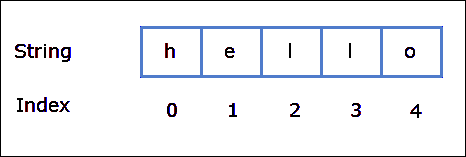
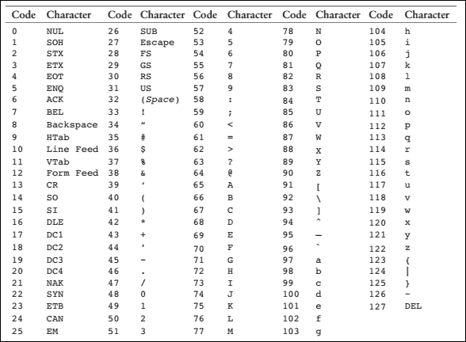
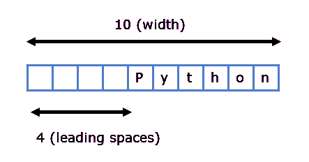

# Python 中的字符串

> 原文:[https://overiq.com/python-101/strings-in-python/](https://overiq.com/python-101/strings-in-python/)

最后更新于 2020 年 9 月 21 日

* * *

字符串是用单引号(`''`)或双引号(`""`)括起来的字符序列。下面是如何在 python 中创建字符串。

```py
>>>
>>> s1 = 'String in single quotes'
>>> s1
'String in single quotes'
>>>
>>> s2 = "String in double quotes"
>>> s2
'String in double quotes'
>>>

```

```py
>>>
>>> 'hello everyone'
'hello everyone'
>>>
>>> "hello everyone"
'hello everyone'
>>>

```

在 Python Shell 或 IDLE 中，字符串总是用单引号显示。但是，如果使用`print()`功能，则仅显示字符串的内容。

```py
>>>
>>> print(s1)
String in single quotes
>>> print(s2)
String in double quotes
>>>

```

[现在试试](https://overiq.com/python-online-compiler/v2m/)

有些语言像 C、C++、Java 把单个字符当作一种特殊类型叫做`char`，但是在 Python 中单个字符也是一个字符串。

```py
>>>
>>> achar = 'a'    # string containing a single character
>>> type(achar)
<class 'str'>
>>>
>>> type("a string")     # string containing multiple characters
<class 'str'>
>>>

```

[现在试试](https://overiq.com/python-online-compiler/wpR/)

## 使用 len()函数计算字符数

`len()`内置函数统计字符串中的字符数。

```py
>>>
>>> len("a string")
8
>>>
>>> s = "a long string"
>>>
>>> len(s)
13
>>>
>>> len("")
0
>>>

```

[现在试试](https://overiq.com/python-online-compiler/xk9/)

## 创建空字符串

```py
>>>
>>> s3 = ''   # empty string using single quotes
>>> s3
''
>>>
>>> s4 = ""   # empty string using double quotes
>>> s4
''
>>>

```

虽然变量`s3`和`s4`不包含任何字符，但它们仍然是有效的字符串。您可以使用`type()`功能来验证这一事实。

```py
>>>
>>> type(s3)
<class 'str'>
>>>
>>> type(s4)
<class 'str'>
>>>

```

[现在试试](https://overiq.com/python-online-compiler/yP7/)

那么在创建字符串时，我应该使用单引号还是双引号呢？

当字符串中有单引号时，双引号就派上用场了。例如:

```py
>>>
>>> print("I'm learning python")
I'm learning python
>>>

```

如果我们使用单引号，我们会得到以下错误:

```py
>>>
>>> print('I'm learning python')
  File "<stdin>", line 1
    print('I'm learning python')
             ^
SyntaxError: invalid syntax
>>>

```

[现在试试](https://overiq.com/python-online-compiler/zpY/)

这里的问题是 Python 解释器认为第二个引号，就在字符`I`之后，标志着字符串的结束，不知道如何处理剩下的字符。

同样，如果要在字符串中打印双引号，只需将整个字符串用单引号而不是双引号括起来。

```py
>>>
>>> print('John says "Hello there !"')
John says "Hello there !"
>>>

```

[现在试试](https://overiq.com/python-online-compiler/ADO/)

还有一种使用转义序列在字符串中嵌入单引号或双引号的方法，这将在下面讨论。

## 转义序列

转义序列是一组特殊字符，用于打印无法使用键盘直接键入的字符。每个转义序列都以反斜杠(`\`)字符开始。

下表列出了一些常见的转义序列。

| 换码顺序 | 意义 |
| --- | --- |
| `\n` | 换行符-打印换行符 |
| `\t` | 制表符-打印制表符 |
| `\\` | 反斜杠-打印反斜杠(`\`)字符 |
| `\'` | 单引号-打印单引号 |
| `\"` | 双引号-打印双引号 |

当转义序列在字符串中使用时，Python 将它们视为特殊命令。例如，字符串中的`\t`字符打印一个制表符(一个制表符等于打印四个空格)。例如:

```py
>>>
>>> s = "Name\tAge\tMarks"
>>> s
'Name\tAge\t\\Marks'
>>> print(s)
Name    Age     Marks
>>>

```

[现在试试](https://overiq.com/python-online-compiler/BBX/)

类似地，字符串中的`\n`字符打印一个换行符。换行符不会显示在屏幕上，而是会使光标从下一行的开头开始打印后续字符。例如:

```py
>>>
>>> s2 = 'One\nTwo\nThree'
>>> s2
'One\nTwo\nThree'
>>> print(s2)
One
Two
Three
>>>

```

[现在试试](https://overiq.com/python-online-compiler/Dkx/)

也可以使用(`\'`)和(`\"`)转义序列在字符串中打印单引号或双引号。例如:

```py
>>>
>>> print('I\'m learning python')
I'm learning python
>>>
>>> print("John says \"Hello there !\"")
John says "Hello there !"
>>>

```

[现在试试](https://overiq.com/python-online-compiler/ERv/)

当我们使用转义序列来打印单引号或双引号时，字符串是否包装在单引号或双引号中并不重要。

同样，要打印单个反斜杠字符(`\`)请使用(`\\`)转义序列。

```py
>>>
>>> s3 = 'C:\\Users\\Q'
>>> s3
'C:\\Users\\Q'
>>> print(s3)
C:\Users\Q
>>>

```

[现在试试](https://overiq.com/python-online-compiler/G67/)

## 串并置

字符串串联意味着将一个或多个字符串连接在一起。为了在 Python 中连接字符串，我们使用`+`运算符。

```py
>>>
>>> s1 = "This is " + "one complete string"
>>> print(s1)
This is one complete string
>>>
>>> s2 = "One " + "really really " + "long string"
>>> print(s2)
One really really long string
>>>

```

[现在试试](https://overiq.com/python-online-compiler/J62/)

请注意，`+`运算符在与两个数字一起使用时会执行数学加法。但是，当与字符串一起使用时，它会将它们连接起来。

```py
>>>
>>> 98+57   # when used with numbers + operators adds them
155
>>>

```

如果其中一个操作数不是字符串，会发生什么？例如:

```py
>>>
>>> s = "Python" + 101
Traceback (most recent call last):
  File "<stdin>", line 1, in <module>
TypeError: Can't convert 'int' object to str implicitly
>>>

```

[现在试试](https://overiq.com/python-online-compiler/KrR/)

这里 wear 试图连接字符串`"Python"`和数字`101`，但是 Python 报告了以下错误:

```py
TypeError: Can't convert 'int' object to str implicitly

```

由于 Python 是一种强类型语言，它不能自动将一种类型的数据转换成完全不同的类型。

那么解决办法是什么呢？

解决方法是使用`str()`函数将整数转换为字符串，如下所示:

```py
>>>
>>> s = str(100)
>>> s
'100'
>>> type(s)
<class 'str'>
>>>

```

```py
>>>
>>> s = "Python" + str(101)
>>> s
'Python101'
>>>

```

[现在试试](https://overiq.com/python-online-compiler/L9w/)

## 字符串重复运算符(*)

就像数字一样，我们也可以使用带字符串的`*`运算符。当与琴弦一起使用时`*`操作者重复琴弦`n`的次数。它的一般格式是:

```py
string * n

```

其中`n`是一个数字类型`int`。

```py
>>>
>>> s = "www " * 5  # repeat "www " 5 times
>>> s
'www www www www www '
>>>
>>>
>>>
>>> print("We have got some", "spam" * 5)
We have got some spamspamspamspamspam
>>>

```

[现在试试](https://overiq.com/python-online-compiler/M8A/)

注意`5 * "www "`和`"www " * 5`产生相同的结果。

`n`必须是`int`。否则，你会得到一个错误。例如:

```py
>>> "www" * "e"   # n is a string
Traceback (most recent call last):
  File "<stdin>", line 1, in <module>
TypeError: can't multiply sequence by non-int of type 'str'
>>>
>>>
>>> "www" * 1.5   # n is a float
Traceback (most recent call last):
  File "<stdin>", line 1, in <module>
TypeError: can't multiply sequence by non-int of type 'float'
>>>

```

[现在试试](https://overiq.com/python-online-compiler/Nk6/)

请注意，错误消息清楚地告诉我们，字符串不能乘以非 int 类型。

## 成员资格运算符-在和不在

`in`或`not in`运算符用于检查一个字符串是否存在于另一个字符串中。例如:

```py
>>>
>>> s1 = "object oriented"
>>>
>>> "ted" in s1    # Does "ted" exists in s1 ?
True
>>>
>>>
>>> "eject" in s1   # Does "eject" exists in s1 ?
False
>>>
>>>
>>> "orion" not in s1   # Doesn't "orion" exists in s1 ?
True
>>>
>>> "en" not in s1   # Doesn't "en" exists in s1 ?
False
>>>
>>>

```

[现在试试](https://overiq.com/python-online-compiler/OYp/)

## 访问字符串中的单个字符

在 Python 中，字符串中的字符是按顺序存储的。我们可以通过使用索引来访问字符串中的单个字符。索引是指字符串中字符的位置。在 Python 中，字符串被`0`索引，这意味着第一个字符在索引`0`处，第二个字符在索引`1`处，以此类推。最后一个字符的索引位置比字符串长度少一个字符。



要访问字符串中的单个字符，我们键入变量的名称，后跟方括号`[]`中字符的索引号。

```py
>>>
>>> s1 = "hello"
>>>
>>> s1[0]    # get the first character
'h'
>>> s1[1]    # get the second character
'e'
>>> s1[2]    # get the third character
'l'
>>> s1[3]    # get the fourth character
'l'
>>> s1[4]    # get the fifth character
'o'
>>>

```

[现在试试](https://overiq.com/python-online-compiler/PNw/)

字符串`s1`的最后一个有效索引是`4`，如果您试图访问最后一个有效索引之外的字符，您将获得如下的`IndexError`:

```py
>>>
>>> s1[5]  # get the sixth character
Traceback (most recent call last):
  File "<stdin>", line 1, in <module>
IndexError: string index out of range
>>>

```

[现在试试](https://overiq.com/python-online-compiler/QWl/)

不用手动统计字符串中最后一个字符的索引位置，我们可以使用`len()`函数计算字符串，然后从中减去`1`得到最后一个字符的索引位置。

```py
>>>
>>> quote = "The best is the enemy of the good"
>>>
>>> quote[len(quote)-1]
'd'
>>>

```

[现在试试](https://overiq.com/python-online-compiler/R6q/)

我们也可以使用负指数。负索引允许我们从字符串的末尾访问字符。负索引从`-1`开始，所以最后一个字符的索引位置是`-1`，第二个最后一个字符是`-2`等等。


```py
>>>
>>> s = "markdown"
>>>
>>> s[-1]        # get the last character
'n'
>>>
>>> s[-2]        # get the second last character
'w'
>>>
>>> s[-8]        # get the first character
'm'
>>>
>>> s[-len(s)]   # get the first character
'm'
>>>

```

[现在试试](https://overiq.com/python-online-compiler/VOM/)

如果负指数小于最后一个有效指数(`-8`)，那么`IndexError`将出现如下情况:

```py
>>>
>>> s[-9]
Traceback (most recent call last):
  File "<stdin>", line 1, in <module>
IndexError: string index out of range
>>>

```

[现在试试](https://overiq.com/python-online-compiler/W6J/)

## 切割字符串

字符串切片允许我们从字符串中获取一部分字符。为了获得字符串的切片，我们使用切片操作符(`[start_index:end_index]`)。它的语法是:

```py
str_name[start_index:end_index]

```

`str_name[start_index:end_index]`从索引`start_index`到`end_index`返回一段字符串。`end_index`处的字符将不包含在切片中。考虑以下示例:

```py
>>>
>>> s = "markdown"
>>>
>>>
>>> s[0:3]  # get a slice of string starting from index 0 to 3, not including the character at index 3
'mar'
>>>
>>>
>>> s[2:5]  # get a slice of string starting from index 2 to 5, not including the character at index 5
'rkd'
>>>

```

[现在试试](https://overiq.com/python-online-compiler/XDW/)

如果`end_index`大于字符串的长度，则切片操作符返回从`start_index`开始到字符串末尾的字符串切片。

```py
>>>
>>> s[2:len(s)+200]
'rkdown'
>>>

```

[现在试试](https://overiq.com/python-online-compiler/YEK/)

`start_index`和`end_index`可选。如果未指定`start_index`，则切片从字符串的开头开始，如果未指定`end_index`，则切片继续到字符串的结尾。例如:

```py
>>>
>>> s[:4]  # start slicing from the beginning
'mark'
>>>

```

[现在试试](https://overiq.com/python-online-compiler/Z6J/)

在上面的表达式中，切片从字符串的开头开始，所以上面的表达式与`s[0:4]`相同。

```py
>>>
>>> s[5:]
'own'
>>>

```

[现在试试](https://overiq.com/python-online-compiler/1wR/)

在这种情况下，结果省略了`end_index`，切片继续到字符串的末尾，因此`s[5:]`与`s[5:len(s)]`相同。

```py
>>>
>>> s[:]
'markdown'
>>>

```

[现在试试](https://overiq.com/python-online-compiler/2kK/)

这里我们省略了`start_index`和`end_index`，因此切片将从开始开始，一直到字符串的结尾。换句话说，`s[:]`和`s[0:len(s)]`是一样的

我们也可以在字符串切片中使用负索引。


因此`s[1:-1]`将从索引`1`开始返回一个切片到`-1`，不包括索引`-1`处的字符。

```py
>>>
>>> s[1:-1]
'arkdow'
>>>

```

[现在试试](https://overiq.com/python-online-compiler/31M/)

## Python 中的一切都是对象

在 Python 中，所有数据都是对象。这意味着一个数字，一个字符串，其他类型的数据实际上是一个对象。为了确定物体的类型，我们使用`type()`功能。

但是什么是对象呢？

## 类和对象-第一印象

在我们学习对象之前，我们必须先学习类。类只是一个定义数据和方法的模板。类内定义的函数称为方法。

```py
class our_class
    data 
    methods

```

当我们定义一个新的类时，我们实际上创建了一个新的数据类型。要使用我们的新类或数据类型，我们必须创建该类的对象。请注意，定义一个类不会占用任何内存空间。只有当我们基于该类创建对象时，才会分配内存。

根据这些新获得的知识，让我们看看当我们给一个变量赋值`int`时会发生什么。

```py
>>> num = 100

```

在上面的陈述中，我们给变量`num`赋值`100`。用面向对象的术语来说，我们刚刚创建了一个对象。要了解对象的类别或类型的更多信息，请使用如下的`type()`方法:

```py
>>>
>>> type(num)
<class 'int'>
>>>

```

`<class 'int'>`表示`num`变量是类`int`的对象。同样，每根弦和`float`分别是`str`和`float`类的对象。

内置类或类型，如`int`、`float`、`str`；定义了许多有用的方法。要调用这些方法，我们使用以下语法:

```py
object.method_name()

```

这里有一个例子:

`str`类提供了像`upper()`和`lower()`这样的方法，分别将字符串转换成大写和小写后返回字符串。

```py
>>>
>>> s1 = "A String"
>>>
>>> s2 = s.lower()
>>> s2
'a string'
>>>
>>> s3 = s1.upper()
>>> s3
'A STRING'
>>>
>>> s3
>>>

```

[现在试试](https://overiq.com/python-online-compiler/4x1/)

这些方法不会改变原始对象(`s1`)的值。这就是为什么在调用`lower()`和`upper()`变量`s1`后仍然指向`"A String"`字符串对象的原因。

```py
>>> 
>>> s1
'A String'
>>>
>>>

```

要知道对象的内存地址，我们可以使用`id()`函数，如下所示:

```py
>>>
>>> id(s1)
15601373811
>>>

```

[现在试试](https://overiq.com/python-online-compiler/5yB/)

注意`15601373811`是`'A String'`字符串对象的地址，不是`s1`变量的地址。在程序执行过程中，对象的内存地址不会改变。但是，它可能会在您每次运行程序时发生变化。如果两个对象相同，那么将具有相同的 id(或地址)。

## ASCII 字符

在计算机中，一切都以 0 和 1 的序列存储。存储数字很容易，只要把它们转换成二进制就可以了。

但是字符是如何存储在内存中的呢？

电脑不能直接在内存中存储`'a'`、`'b'`、`'1'`、`'$'`等字符串。相反，它们存储的是代表字符的数字代码。字符及其数字代码的映射称为 ASCII(美国信息交换标准代码)字符集。ASCII 字符集有 128 个字符。

除了在美国键盘中找到的字符，ASCII 集还定义了一些控制字符。控制字符用于发出命令，它们是不可打印的字符。

控制字符的一个例子是 Ctrl+D，它通常用于终止外壳窗口。ASCII 表中的这个字符用`EOT`(传输结束)表示，ASCII 值为 4。

下表显示了 ASCII 字符集的所有 128 个字符。



这里有几件事需要注意:

*   从`A`到`Z`的所有大写字母都有从`65`到`90`的 ASCII 值。
*   从`'a'`到`'z'`的所有小写字母都有从`97`到`122`的 ASCII 值。
*   当我们在字符串中使用数字(`0` - `9`)时，它们是用从`48`到`57`的 ASCII 值来表示的。

## order()和 chr()函数

`ord()`函数返回一个字符的 ASCII 值，`chr()`函数返回由 ASCII 值表示的字符。

### order()函数

```py
>>>
>>> ord("a")  # print the ASCII value of character a
97
>>>
>>> ord("5")  # print the ASCII value of character 5
53
>>>

```

[现在试试](https://overiq.com/python-online-compiler/68n/)

### chr()函数

```py
>>>
>>> chr(97)   # print the character represented by ASCII value 97
'a'
>>>
>>> chr(53)   # print the character represented by ASCII value 53
'5'
>>>

```

[现在试试](https://overiq.com/python-online-compiler/73j/)

## print()函数中抑制换行符

默认情况下，`print()`函数打印给定的参数，后跟一个换行符(`\n`)。例如:

**蟒蛇 101/章节-07/换行符 _ at _ end . py**

```py
print("first line")
print("second line")

```

**输出:**

```py
first line
second line

```

[现在试试](https://overiq.com/python-online-compiler/82m/)

请注意，字符串`"second line"`打印在下一行的开头，这是因为第一个`print()`调用打印的换行符(`\n`)导致输出从下一行开始。

我们可以通过传递一个名为`end`的特殊参数来改变`print()`函数的这种行为。假设我们想在输出的末尾打印`$`字符，而不是换行符(`\n`)。为此调用`print()`函数如下:

**蟒蛇 101/章-07/dollor _ at _ end . py**

```py
print("first string", end="$")
print("second string", end="$")

```

**输出:**

```py
first string$second string$

```

[现在试试](https://overiq.com/python-online-compiler/9rx/)

请注意两个字符串末尾的`'$'`字符。由于第一条语句没有在输出的末尾打印一个换行符，所以第二条`print()`的输出从同一行开始。

如果您不想在输出结束时打印任何内容，请将`end=""`传递到`print()`功能，如下所示:

**蟒蛇 101/第-07 章/无 _at_end.py**

```py
print("first", end="")
print("second", end="")
print("third")

```

**输出:**

```py
firstsecondthird

```

[现在试试](https://overiq.com/python-online-compiler/0Rv/)

在这种情况下，前两个语句在输出的末尾打印一个空字符串(`""`)，但是最后一个语句打印`"third"`，后跟一个换行符(`'\n'`)。

## 在打印中指定分隔符()函数

我们已经在第[课中讨论了 Python 中的数据类型和变量](/python-101/data-types-and-variables-in-python/#displaying-multiple-items-with-the-print-function)，当我们将多个参数传递给`print()`函数时，它们被打印到控制台上，用空格隔开。

```py
>>>
>>> print("first", "second", "third")
first second third
>>>

```

[现在试试](https://overiq.com/python-online-compiler/g5Y/)

为了覆盖这个行为，我们使用了另一个特殊的参数`sep`作为分隔符的缩写。假设我们想通过`#`将每个项目分开。为此，调用`print()`函数如下:

```py
>>>
>>> print("first", "second", "third", sep="#")
first#second#third
>>>

```

[现在试试](https://overiq.com/python-online-compiler/j2R/)

## 字符串比较

就像数字一样，我们也可以使用[关系运算符](/python-101/operators-in-python/#relational-operators)来比较字符串。但是，与数字不同，字符串比较稍微复杂一些。Python 中的字符串使用其对应字符的 ASCII 值进行比较。比较从比较两个字符串的第一个字符开始。如果它们不同，则比较相应字符的 ASCII 值以确定比较结果。另一方面，如果它们相等，则比较下两个字符。这个过程一直持续到任何一个字符串用完。如果一个短字符串出现在另一个长字符串的开头，那么短字符串就是较小的字符串。在技术术语中，这种类型的比较被称为词典式比较。

让我们举一些例子:

**例 1:**

```py
>>>
>>> "linker" > "linquish"
False
>>>

```

[现在试试](https://overiq.com/python-online-compiler/k55/)

以下是评估上述表达式的步骤:

**第一步**:`"link"`的`"l"`与`"linq"`的`"l"`比较。由于它们相等，接下来的两个字符将被比较。

**第二步**:`"link"`的`"i"`与`"linq"`的`"i"`进行对比。同样，它们是相等的，接下来的两个字符进行比较。

**第三步**:`"link"`的`"n"`与`"linq"`的`"n"`进行对比。同样，它们是相等的，接下来的两个字符进行比较。

**第四步**:将`"link"`的`"k"`与`"linq"`的`"q"`进行比较。因为对应的字符不相同，所以比较在这一步停止。`k`的 ASCII 值是`107`，`q`的 ASCII 值是`113`，也就是说`"k"`比`"q"`小。因此弦`"linker"`比`"linquish"`小。因此`"linker" > "linquish"`这个表达是错误的。

**例 2:**

```py
>>>
>>> "qwerty" > "abc"
True
>>>

```

[现在试试](https://overiq.com/python-online-compiler/lO5/)

`"qwerty"`的`"q"`与`"abc"`的`"a"`相比较。此时，比较停止，因为对应的字符不相同。由于`"q"`的 ASCII 值为`113`，`"a"`的 ASCII 值为`97`，所以`"q"`大于`"a"`。因此弦`"qwerty"`大于`"abc"`。

**例 3:**

```py
>>>
>>> "ab" > "abc"
False
>>>

```

[现在试试](https://overiq.com/python-online-compiler/mwO/)

这里短弦`"ab"`出现在另一个长弦`"abc"`的开始处。因此`"ab"`是较小的一个。

更多示例:

```py
>>>
>>> "tree" == "tree" 
True
>>>
>>> "pass" != "password"
True
>>>
>>> "@@@" <= "123"
False
>>>
>>> "" <= "123"
True
>>>

```

[现在试试](https://overiq.com/python-online-compiler/nZR/)

字符串比较是编程中常见的操作。字符串比较的一个实际用途是按升序或降序对字符串进行排序。

## 字符串是不可变的

字符串对象是不可变的。这意味着我们不能在字符串对象创建后更改其内容。考虑以下示例:

```py
>>>
>>> s = "hello"
>>>
>>> id(s)
35145912
>>>

```

这里我们已经创建了一个新的字符串对象，然后我们使用`id()`函数来知道我们的字符串对象的地址。

让我们看看如果我们试图通过在字符串对象的末尾添加`" world"`来修改现有的字符串对象`s`会发生什么。

```py
>>>
>>> s += " world"
>>> s
'hello world'
>>>
>>> id(s)
35150448
>>>

```

[现在试试](https://overiq.com/python-online-compiler/oYj/)

请注意，变量`s`现在指向一个全新的地址，这是因为每次我们修改一个字符串对象，我们都会在这个过程中创建新的字符串对象。这证明了字符串对象是不可变的。

形式`variable[index]`的表达式就像一个变量。因此，它们也可以出现在赋值运算符的左侧。例如:

```py
>>>
>>> s[0] = 'y'
Traceback (most recent call last):
  File "<stdin>", line 1, in <module>
TypeError: 'str' object does not support item assignment
>>>

```

[现在试试](https://overiq.com/python-online-compiler/pg2/)

这里，我们试图通过为索引`0`处的元素分配一个新字符串来更新它。操作失败，因为字符串对象是不可变的。如果字符串是可变的，上述操作就会成功。

## 使用 format()函数格式化字符串

就像数字一样，我们也可以使用`format()`函数来格式化字符串。要格式化字符串，我们使用类型代码`s`和指定的宽度，例如:

```py
>>>
>>> print(format("Python", "10s"))
Python
>>>

```

[现在试试](https://overiq.com/python-online-compiler/qj2/)


与数字不同，字符串默认为左对齐。这意味着，当宽度大于值的长度时，该值将左对齐打印，用尾随空格代替前导空格。

如果字符串的长度大于指定的宽度，则宽度会自动增加以匹配字符串的长度。

```py
>>>
>>> print(format("Python", "4s"))
Python
>>>

```

[现在试试](https://overiq.com/python-online-compiler/r0E/)

要右对齐一个字符串，请使用如下符号`>`:

```py
>>>
>>> print(format("Python", ">10s"))
    Python
>>>
>>>

```

[现在试试](https://overiq.com/python-online-compiler/vgm/)



语句`print(format("Python", "<10s"))`与`print(format("Python", "10s"))`相同，因为默认情况下字符串是左对齐打印的。

* * *

* * *