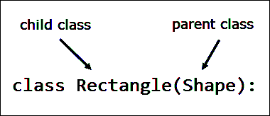

# Python 中的继承和多态性

> 原文:[https://overiq . com/python-101/python 中的继承和多态性/](https://overiq.com/python-101/inheritance-and-polymorphism-in-python/)

最后更新于 2020 年 9 月 22 日

* * *

继承是一种机制，它允许我们通过在现有类的基础上添加新的属性和方法来创建一个基于现有类的新类，即父类。这样做时，子类继承父类的属性和方法。

当您想要创建非常相似的类时，继承真的会发光。您所需要做的就是为它们在一个类(父类)中共有的东西编写代码。然后为不同类中非常具体的东西编写代码——子类。这样可以避免大量代码的重复。

让我们举一个更具体的例子来说明这个概念。

假设我们正在创建一个处理各种形状的程序。每个形状都有一些共同的属性。比如形状的颜色，是否填充等等。除此之外，还有一些不同形状的属性。例如，面积和周长。矩形面积为`width * length`，圆形面积为`πr²`。首先，为不同的形状创建类可能很有诱惑力，比如:

```py
class Rectangle:
    def __init__(self, color, filled, width, length):
        self.__color = color
        self.__filled = filled
        self.__width = width
        self.__length = length

    def get_color(self):
        return self.__color

    def set_color(self, color):
        self.__color = color

    def is_filled(self):
        return self.__filled

    def set_filled(self, filled):
        self.__filled = filled

    def get_area(self):
        return self.__width * self.__length

class Circle:
    def __init__(self, color, filled, radius):
        self.__color = color
        self.__filled = filled
        self.__radius = radius      

    def get_color(self):
        return self.__color

    def set_color(self, color):
        self.__color = color

    def is_filled(self):
        return self.__filled

    def set_filled(self, filled):
        self.__filled = filled

    def get_area(self):
        return math.pi * self.__radius ** 2

```

[现在试试](https://overiq.com/python-online-compiler/BNx/)

你注意到我们正在编写的大量重复代码了吗？

两个类共享相同的`__color`和`__filled`属性以及它们的`getter`和`setter`方法。更糟糕的是，如果我们想要更新这些方法的工作方式，那么我们必须逐个访问每个类来进行必要的更改。通过使用继承，我们可以抽象出通用的`Shape`类(父类)的公共属性，然后我们可以创建从`Shape`类继承的子类，如`Rectangle`、`Triangle`和`Circle`。子类类继承了父类的所有属性和方法，但是它也可以添加自己的属性和方法。

要基于父类创建子类，我们使用以下语法:

```py
class ParentClass:
    # body of ParentClass
    # method1 
    # method2

class ChildClass(ParentClass):
    # body of ChildClass
    # method 1
    # method 2

```

在面向对象的行话中，当类`c2`从类`c1`继承时，我们说类`c2`扩展类`c1`或者类`c2`是从类`c1`派生出来的。

下面的程序演示了继承的作用。它创建了一个名为`Shape`的类，该类包含所有形状共有的属性和方法，然后它创建了两个子类`Rectangle`和`Triangle`，这两个子类只包含它们特有的属性和方法。

**蟒蛇 101/第 16 章/继承. py**

```py
import math

class Shape:

    def __init__(self, color='black', filled=False):
        self.__color = color
        self.__filled = filled

    def get_color(self):
        return self.__color

    def set_color(self, color):
        self.__color = color

    def get_filled(self):
        return self.__filled

    def set_filled(self, filled):
        self.__filled = filled

class Rectangle(Shape):

    def __init__(self, length, breadth):
        super().__init__()
        self.__length = length
        self.__breadth = breadth

    def get_length(self):
        return self.__length

    def set_length(self, length):
        self.__length = length

    def get_breadth(self):
        return self.__breadth

    def set_breadth(self, breadth):
        self.__breadth = breadth

    def get_area(self):
        return self.__length * self.__breadth

    def get_perimeter(self):
        return 2 * (self.__length + self.__breadth)

class Circle(Shape):
    def __init__(self, radius):
        super().__init__()
        self.__radius = radius

    def get_radius(self):
        return self.__radius

    def set_radius(self, radius):
        self.__radius = radius

    def get_area(self):
        return math.pi * self.__radius ** 2

    def get_perimeter(self):
        return 2 * math.pi * self.__radius

r1 = Rectangle(10.5, 2.5)

print("Area of rectangle r1:", r1.get_area())
print("Perimeter of rectangle r1:", r1.get_perimeter())
print("Color of rectangle r1:", r1.get_color())
print("Is rectangle r1 filled ? ", r1.get_filled())
r1.set_filled(True)
print("Is rectangle r1 filled ? ", r1.get_filled())
r1.set_color("orange")
print("Color of rectangle r1:", r1.get_color())

c1 = Circle(12)

print("\nArea of circle c1:", format(c1.get_area(), "0.2f"))
print("Perimeter of circle c1:", format(c1.get_perimeter(), "0.2f"))
print("Color of circle c1:", c1.get_color())
print("Is circle c1 filled ? ", c1.get_filled())
c1.set_filled(True)
print("Is circle c1 filled ? ", c1.get_filled())
c1.set_color("blue")
print("Color of circle c1:", c1.get_color())

```

[现在试试](https://overiq.com/python-online-compiler/D1B/)

**输出:**

```py
Area of rectagle r1: 26.25
Perimeter of rectagle r1: 26.0
Color of rectagle r1: black
Is rectagle r1 filled ?  False
Is rectagle r1 filled ?  True
Color of rectagle r1: orange

Area of circle c1: 452.39
Perimeter of circle c1: 75.40
Color of circle c1: black
Is circle c1 filled ?  False
Is circle c1 filled ?  True
Color of circle c1: blue

```

在第 3-19 行，我们定义了一个`Shape`类。它是一个父类，只包含所有形状共有的属性和方法。这个类定义了两个私有属性`__color`和`__filled`，然后它为这些属性提供了 getter 和 setter 方法。

在第 22-45 行，我们定义了一个继承自`Shape`类的`Rectangle`类。请密切注意我们使用的语法。



这句台词告诉我们`Rectangle`类扩展了`Shape`类或者`Rectangle`类是`Shape`类的子类。因此`Rectangle`类继承了`Shape`类中定义的属性和方法。除此之外，`Rectangle`类增加了两个私有属性，私有属性的 getter 和 setter 方法，以及计算矩形面积和周长的方法。

注意第 25 行的代码。

```py
super().__init__()

```

在 Python 中，我们使用`super()`函数来调用父类方法。所以上面的代码调用了`Shape`类的`__init__()`方法。这是在父类中设置属性值所必需的。否则，当您试图使用 getter 或 setter 方法访问父类中定义的属性值时，您将会得到一个错误。

类似地，在第 48-63 行，我们定义了一个`Circle`类。就像`Rectangle`一样，它扩展了`Shape`类，并且几乎没有增加自己的属性和方法。

第 66-86 行代码创建`Rectangle`和`Circle`对象，然后在这些对象上逐个调用`get_area()`、`get_perimeter()`、`get_filled()`、`get_color()`、`set_color()`和`set_filled()`方法。注意我们如何能够调用在同一个类中定义的方法，以及在父类中定义的方法。

## 多重继承

Python 允许我们同时从几个类中派生一个类，这就是所谓的多重继承。它的一般格式是:

```py
Class ParentClass_1:
    # body of ParentClass_1

Class ParentClass_2:
    # body of ParentClass_2

Class ParentClass_3:
    # body of ParentClass_1

Class ChildClass(ParentClass_1, ParentClass_2, ParentClass_3):
    # body of ChildClass

```

`ChildClass`来源于三个类`ParentClass_1`、`ParentClass_2`、`ParentClass_3`。因此，它将从所有三个类继承属性和方法。

以下程序演示了多重继承的作用:

**蟒 101/第-16 章/多重 _ 继承. py**

```py
class A:
    def explore(self):
        print("explore() method called")

class B:
    def search(self):
        print("search() method called")

class C:
    def discover(self):
        print("discover() method called")

class D(A, B, C):
    def test(self):
        print("test() method called")

d_obj = D()
d_obj.explore()
d_obj.search()
d_obj.discover()
d_obj.test()

```

[现在试试](https://overiq.com/python-online-compiler/E8N/)

**输出:**

```py
explore() method called
search() method called
discover() method called
test() method called

```

## 多态性和方法覆盖

在字面意义上，多态性意味着采取各种形式的能力。在 Python 中，多态性允许我们在子类中定义与父类中定义的名称相同的方法。

正如我们所知，子类继承了父类的所有方法。但是，您会遇到从父类继承的方法不太适合子类的情况。在这种情况下，您必须在子类中重新实现方法。这个过程被称为方法覆盖。

如果在子类中重写了一个方法，那么该方法的版本将根据用于调用它的对象的类型来调用。如果子类对象用于调用被重写的方法，则调用该方法的子类版本。另一方面，如果父类对象用于调用被重写的方法，则调用该方法的父类版本。

以下程序演示了方法重写的操作:

**蟒蛇 101/第 16 章/方法 _ 覆盖. py**

```py
class A:
    def explore(self):
        print("explore() method from class A")

class B(A):
    def explore(self):
        print("explore() method from class B")

b_obj = B()
a_obj = A()

b_obj.explore()
a_obj.explore()

```

[现在试试](https://overiq.com/python-online-compiler/Gvy/)

**输出:**

```py
explore() method from class B
explore() method from class A

```

这里`b_obj`是类`B`(子类)的一个对象，因此，类`B`版本的`explore()`方法被调用。但是，变量`a_obj`是类`A`(父类)的对象，因此调用了类`A`版本的`explore()`方法。

如果出于某种原因，您仍然想要访问子类中父类的被覆盖方法，您可以使用`super()`函数调用它，如下所示:

**蟒蛇 101/第 16 章/方法 _ 覆盖 _2.py**

```py
class A:
    def explore(self):
        print("explore() method from class A")

class B(A):
    def explore(self):
        super().explore()  # calling the parent class explore() method
        print("explore() method from class B")

b_obj = B()
b_obj.explore()

```

[现在试试](https://overiq.com/python-online-compiler/J8D/)

**输出:**

```py
explore() method from class A
explore() method from class B

```

## 对象-基类

在 Python 中，所有类都隐式继承自`object`类。这意味着以下两个类定义是等价的。

```py
class MyClass:
    pass

class MyClass(object):
    pass

```

原来`object`类提供了一些特殊的方法，有两个前导和尾随下划线，所有的类都继承了这两个下划线。以下是`object`类提供的一些重要方法。

1.  `__new__()`
2.  `__init__()`
3.  `__str__()`

`__new__()`方法创建对象。创建对象后，它调用`__init__()`方法初始化对象的属性。最后，它将新创建的对象返回给调用程序。通常情况下，我们不会覆盖`__new__()`方法，但是，如果你想显著改变一个对象的创建方式，你绝对应该覆盖它。

`__str__()`方法用于返回对象的格式良好的字符串表示。`__str__()`方法的`object`类版本返回一个包含类名称及其十六进制内存地址的字符串。例如:

**蟒蛇 101/第 16 章/_ _ str _ _ 法. py**

```py
class Jester:
    def laugh(self):
        return print("laugh() called")

obj = Jester()
print(obj)

```

[现在试试](https://overiq.com/python-online-compiler/K8r/)

**输出:**

```py
<__main__.Jester object at 0x0000000002167E80>

```

当然，这不是很有帮助。我们可以通过在`Jester`类中定义一个名为`__str__()`的方法来轻松覆盖这个方法，如下所示。

**蟒蛇 101/第 16 章/覆盖 _ _ str _ _ 方法. py**

```py
class Jester:
    def laugh(self):
        return "laugh() called"

    def __str__(self):
        return "A more helpful description"

obj = Jester()
print(obj)

```

[现在试试](https://overiq.com/python-online-compiler/LZg/)

**输出:**

```py
A more helpful description

```

* * *

* * *