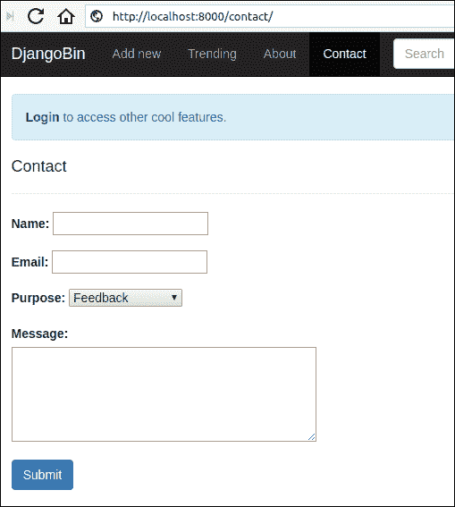

# 构建联系我们表单

> 原文:[https://overiq.com/django-1-11/building-contact-us-form/](https://overiq.com/django-1-11/building-contact-us-form/)

最后更新于 2020 年 7 月 27 日

* * *

在本课中，我们将创建一个联系人表单。这将允许我们的访问者直接向管理电子邮件地址发送反馈。

我们在最后几章中构建的表单与 models 类密切相关。然而，也有可能(有时更可行)创建独立的表单，而与模型没有任何关系。举一个完整过程的例子，我们将在本章中构建的 Contact 表单将继承自`forms.Form`类，而不是`forms.ModelForm`。但在此之前，我们必须学会如何与 Django 发送电子邮件。

## 与Django一起发送电子邮件

要发送电子邮件，Django 要求您添加一些配置。以下是 Django 提供的一些常见配置选项的列表:

*   `SERVER_EMAIL`:指定 Django 发送错误信息给`ADMINS`和`MANAGERS`的邮件地址。

*   `EMAIL_BACKEND`:指定用于发送邮件的后端的名称。`django.core.mail.backends.smtp.EmailBackend`表示Django将使用 SMTP 服务器发送电子邮件。Django 还有很多其他后台。以下是另外两个常用的后端:

    *   `django.core.mail.backends.filebased.EmailBackend`
    *   `django.core.mail.backends.console.EmailBackend`

    前者允许我们将电子邮件写入文件，而不是将其转发到 SMTP 服务器。后者将电子邮件直接打印到控制台。

*   `EMAIL_HOST`:指定邮件服务器或 SMTP 服务器的地址。

*   `EMAIL_HOST_USER`:指定 SMTP 服务器的用户名。

*   `EMAIL_HOST_PASSWORD`:SMTP 服务器的密码。

*   `EMAIL_PORT`:用于连接到 SMTP 服务器的端口。

*   `EMAIL_USE_TLS`:指定是否使用 TLS 安全。

*   `DEFAULT_FROM_EMAIL`:指定站点管理员普通通信使用的默认电子邮件地址。

*   `ADMINS`:指定发送错误通知的人员列表。当站点处于生产状态(即`DEBUG = False`)并且任何视图引发异常时，Django 将向`ADMINS`列表中指定的所有人员发送电子邮件。`ADMINS`列表中的每一项都是一个元组。例如:

    ```py
    ADMINS = [    
        ('name1', 'name1@email.com'),
        ('name2', 'name2@email.com'),
    ]

    ```

*   `MANAGERS`:指定 404 个未发现错误发送断链邮件的人员列表。它接受与`ADMINS`相同格式的电子邮件。

    ```py
    MANAGERS = [    
        ('name1', 'name1@email.com'),
        ('name2', 'name2@email.com'),
    ]

    ```

    要启用此功能，您必须在`settings.py`文件的`MIDDLEWARE`设置中添加`django.middleware.common.BrokenLinkEmailsMiddleware`中间件。

下面的列表显示了通过 Gmail SMTP 服务器发送电子邮件所需的配置。

```py
SERVER_EMAIL = 'infooveriq@gmail.com'
EMAIL_BACKEND = 'django.core.mail.backends.smtp.EmailBackend'
EMAIL_HOST = 'smtp.gmail.com'
EMAIL_HOST_PASSWORD = 'password'
EMAIL_HOST_USER = SERVER_EMAIL
EMAIL_PORT = 587
EMAIL_USE_TLS = True
DEFAULT_FROM_EMAIL = EMAIL_HOST_USER

```

我们正处于开发阶段，只想发送测试电子邮件。因此，我们将使用控制台后端。打开`settings.py`并在文件末尾添加以下选项:

**djangobin/django _ project/django _ project/settings . py**

```py
#...
MEDIA_ROOT  = os.path.join(BASE_DIR, 'media')

MEDIA_URL = '/media/'

EMAIL_BACKEND = 'django.core.mail.backends.console.EmailBackend'

SERVER_EMAIL = 'infooveriq@gmail.com'
DEFAULT_FROM_EMAIL = SERVER_EMAIL

ADMINS = (
    ('OverIQ', 'admin@overiq.com'),
)

MANAGERS = (
    ('OverIQ', 'manager@overiq.com'),
)

```

## 使用 sendtestemail 测试电子邮件

Django 提供`sendtestemail`命令，该命令向指定的电子邮件 id 发送测试电子邮件。它使用`DEFAULT_FROM_EMAIL`设置中指定的电子邮件 id 发送电子邮件。

在终端中输入以下命令:

```py
$ ./manage.py sendtestemail test@example.com
Content-Type: text/plain; charset="utf-8"
MIME-Version: 1.0
Content-Transfer-Encoding: 7bit
Subject: Test email from pc on 2018-04-14 08:02:32.394195+00:00
From: infooveriq@gmail.com
To: test@example.com
Date: Sat, 14 Apr 2018 08:02:32 -0000
Message-ID: <20180414080232.16065.81775@pc>

If you're reading this, it was successful.
-------------------------------------------------------------------------------

```

如果您得到与上面相同的输出，那么这意味着一切都在按预期工作。

除了向指定的电子邮件 id 发送电子邮件，您还可以使用`--admins`或`--managers`选项让`sendtestemail`向`ADMINS`或`MANAGERS`发送电子邮件:

```py
$ ./manage.py sendtestemail --managers
Content-Type: text/plain; charset="utf-8"
MIME-Version: 1.0
Content-Transfer-Encoding: 7bit
Subject: [Django] Test email from pc on 2018-04-14 08:05:12.545568+00:00
From: infooveriq@gmail.com
To: manager@overiq.com
Date: Sat, 14 Apr 2018 08:05:12 -0000
Message-ID: <20180414080512.16961.91759@pc>

This email was sent to the site managers.
-------------------------------------------------------------------------------

```

```py
$ ./manage.py sendtestemail --admins
Content-Type: text/plain; charset="utf-8"
MIME-Version: 1.0
Content-Transfer-Encoding: 7bit
Subject: [Django] Test email from pc on 2018-04-14 08:08:31.878881+00:00
From: infooveriq@gmail.com
To: admin@overiq.com
Date: Sat, 14 Apr 2018 08:08:31 -0000
Message-ID: <20180414080831.17122.89062@pc>

This email was sent to the site admins.
-------------------------------------------------------------------------------

```

## send_mail()函数

`send_mail()`是在Django发邮件最简单的方式。它的语法是:

```py
send_mail(subject, message, from_email, recipient_list)

```

`Subject`:邮件主题。

`message`:消息。

`from_email`:发件人的邮件

`recipient_list`:收件人列表

成功后`send_mail()`返回`1`，否则`0`返回。

## mail_admins()函数

`main_admins()`功能向`ADMINS`设置中指定的管理员发送电子邮件。它的语法是:

```py
mail_admins(subject, message, fail_silently=False)

```

`Subject`:邮件的主题。

`message`:要发送的消息。

它使用在`SERVER_EMAIL`设置中指定的电子邮件作为发送者的电子邮件。

由于我们有兴趣向管理员发送电子邮件，这是我们在构建“联系我们”页面时要使用的功能。

## 创建联系我们页面

打开`forms.py`文件，将`ContactForm`类添加到文件末尾，如下所示:

**djangobin/django _ project/djangobin/forms . py**

```py
#...

class ContactForm(forms.Form):
    BUG = 'b'
    FEEDBACK = 'fb'
    NEW_FEATURE = 'nf'
    OTHER = 'o'
    purpose_choices = (
        (FEEDBACK, 'Feedback'),
        (NEW_FEATURE, 'Feature Request'),
        (BUG, 'Bug'),
        (OTHER, 'Other'),
    )

    name = forms.CharField()
    email = forms.EmailField()
    purpose = forms.ChoiceField(choices=purpose_choices)
    message = forms.CharField(widget=forms.Textarea(attrs={'cols': 40, 'rows': 5}))

```

在`views.py`文件中，添加名为`contact`的视图，如下所示:

**djangobin/django_project/djangobin/views.py**

```py
#...
from django.core.mail import mail_admins
import datetime
from .forms import SnippetForm, ContactForm
from .models import Language, Snippet, Tag
from .utils import paginate_result
#...

def trending_snippets(request, language_slug=''):
    #...

def contact(request):
    if request.method == 'POST':
        f = ContactForm(request.POST)
        if f.is_valid():

            name = f.cleaned_data['name']
            subject = "You have a new Feedback from {}:<{}>".format(name, f.cleaned_data['email'])

            message = "Purpose: {}\n\nDate: {}\n\nMessage:\n\n {}".format(
                dict(f.purpose_choices).get(f.cleaned_data['purpose']),
                datetime.datetime.now(),
                f.cleaned_data['message']
            )

            mail_admins(subject, message)
            messages.add_message(request, messages.INFO, 'Thanks for submitting your feedback.')

            return redirect('djangobin:contact')

    else:
        f = ContactForm()

    return render(request, 'djangobin/contact.html', {'form': f})

```

此视图显示联系人表单，并将提交的响应发送给所有管理员。

请注意我们如何在电子邮件正文中设置目的。`purpose`字段的数据将是`purpose_choices`中元组的第一个元素，即`b`、`fb`、`nf`或`o`。这些信不是很有帮助。这就是为什么我们首先将元组转换成字典，然后使用存储在`cleaned_data`中的密钥来访问更可读的值。

接下来，在`templates`目录中创建一个名为`contact.html`的模板，代码如下:

**djangobin/django _ project/djangobin/templates/djangobin/contact . html**

```py



    Contact Us - {{ block.super }}




    <h4>Contact </h4>
    <hr>

    
        
            <p class="alert alert-info">
                {{ message }}
            </p>
        
    

    <form method="post">

        

        <div class="form-group row">
            <div class="col-lg-5">
                {{ form.name.errors }}
                {{ form.name.label_tag }}
                {{ form.name }}
            </div>
        </div>

        <div class="form-group row">
            <div class="col-lg-5">
                {{ form.email.errors }}
                {{ form.email.label_tag }}
                {{ form.email }}
            </div>
        </div>

        <div class="form-group row">
            <div class="col-lg-5">
                {{ form.purpose.errors }}
                {{ form.purpose.label_tag }}
                {{ form.purpose }}
            </div>
        </div>

        <div class="form-group row">
            <div class="col-lg-5">
                {{ form.message.errors }}
                {{ form.message.label_tag }}
                {{ form.message }}
            </div>
        </div>

        <button type="submit" class="btn btn-primary">Submit</button>
    </form>



```

在`urls.py`中添加新的网址模式，如下所示:

**决哥/决哥 _ 项目/决哥/URL . py】**

```py
#...
urlpatterns = [
    #...
    url('^tag/(?P<tag>[\w-]+)/$', views.tag_list, name='tag_list'),
    url('^download/(?P<snippet_slug>[\d]+)/$', views.download_snippet, name='download_snippet'),
    url('^raw/(?P<snippet_slug>[\d]+)/$', views.raw_snippet, name='raw_snippet'),    
    url('^contact/$', views.contact, name='contact')    
]

```

接下来，在`base.html`中添加联系我们表单的链接，如下所示:

**决哥/决哥 _ project/决哥/样板/决哥/base.html**

```py
{# ... #}
        <!-- Collect the nav links, forms, and other content for toggling -->
        <div class="collapse navbar-collapse" id="bs-example-navbar-collapse-1">
            <ul class="nav navbar-nav">
                <li class='active' >
                    <a href="">Add new</a>
                </li>
                <li class='active'>
                    <a href="">Trending<span class="sr-only">(current)</span></a>
                </li>
                <li class='active'>
                    <a href="">About</a>
                </li>
                <li class='active'>
                    <a href="">Contact</a>
                </li>
            </ul>
{# ... #}

```

要查看我们的创作，请访问`http://127.0.0.1:8000/contact/`并尝试提交一两个反馈。



提交后，您将获得如下成功消息:


在运行服务器的 shell 中，您应该获得如下输出:

```py
[10/May/2018 14:19:05] "GET /contact/ HTTP/1.1" 200 9875
Content-Type: text/plain; charset="utf-8"
MIME-Version: 1.0
Content-Transfer-Encoding: 7bit
Subject: [Django] You have a new Feedback from spike:<spike@mail.com>
From: infooveriq@gmail.com
To: admin@overiq.com
Date: Thu, 10 May 2018 14:19:30 -0000
Message-ID: <20180510141930.6825.79585@pc>

Purpose: Feedback

Date: 2018-05-10 14:19:30.825265

Message:

Lorem ipsum dolor sit amet, consectetur adipisicing elit. Amet, animi assumenda eos exercitationem incidunt molestias nihil non quas soluta voluptatibus! Architecto blanditiis eos nulla quas! A odit optio quibusdam voluptatibus!
-------------------------------------------------------------------------------

```

* * *

* * *