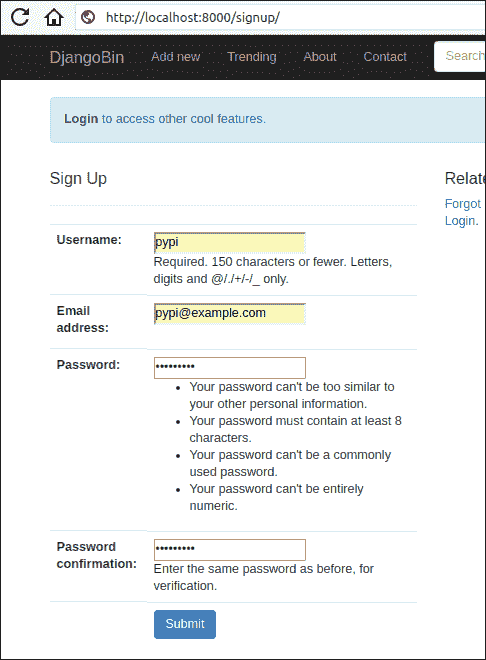
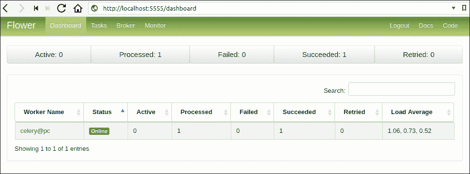

# Celery异步任务

> 原文:[https://overiq . com/django-1-11/异步-任务-带-Celery/](https://overiq.com/django-1-11/asynchronous-tasks-with-celery/)

最后更新于 2020 年 7 月 27 日

* * *

## Celery是什么

Django 是为短期请求设计的。因此，如果您需要执行一个长时间运行的操作，您应该总是在请求-响应周期之外执行它。

以下是长期运行操作的一些示例:

*   发送电子邮件或群发邮件
*   转码媒体文件
*   图像处理
*   生成报告

等等。

试图在请求-响应周期内执行这些操作将显著增加 HTTP 响应的等待时间和大小。这最终可能会把用户从网站上赶走。此外，这些操作也会失败。出于这个原因，我们可能需要一个重试策略。

解决方案是维护一个长时间运行的操作队列，并异步启动它们。

幸运的是，我们有一个很棒的包装叫Celery，它可以为我们提供所有的照明。

引用Celery文档:

> Celery是一个基于分布式消息传递的异步任务队列。它专注于实时操作，但也支持调度。

除了运行异步任务，Celery还为您提供了定期执行任务的选项。

要安装Celery，请执行以下命令:

```py
$ pip install celery

```

接下来，您需要一个消息代理。代理是将任务存储为队列的地方。代理将这些消息发送给Celery工人，然后Celery工人执行任务并提供响应。默认情况下，Celery使用 RabbitMQ 作为消息代理。要安装 RabbitMQ，请执行以下命令:

```py
$ sudo apt-get install rabbitmq-server

```

安装后，rabbitmq-server 将自动启动。您可以使用以下命令检查 rabbitmq 服务器的状态:

```py
$ sudo service rabbitmq-server status

```

如果由于某种原因 rabbtmq-server 没有自动启动，请在 shell 中键入以下命令:

```py
$ sudo service rabbitmq-server start

```

要停止 rabbitmq 服务器，请使用以下命令:

```py
$ sudo service rabbitmq-server stop

```

## Celery与Django的融合

要将Celery添加到 Django 项目中，我们必须首先创建一个`Celery`应用实例以及一些配置。

在 Django 配置目录中的`settings.py`旁边创建一个名为`celery.py`的新文件，并向其中添加以下代码:

**djangobin/django _ project/django _ project/Celery. py**

```py
from __future__ import absolute_import, unicode_literals
import os
from celery import Celery

# set the default Django settings module for the 'celery' program.
os.environ.setdefault('DJANGO_SETTINGS_MODULE', 'django_project.settings')

app = Celery('djangobin')

# Using a string here means the worker doesn't have to serialize
# the configuration object to child processes.
# - namespace='CELERY' means all celery-related configuration keys
#   should have a `CELERY_` prefix.
app.config_from_object('django.conf:settings', namespace='CELERY')

# Load task modules from all registered Django app configs.
app.autodiscover_tasks()

```

在第 1-3 行，我们正在导入必要的功能和模块。

在第 6 行，我们为`celery`命令行应用设置`DJANGO_SETTINGS_MODULE`环境变量。

在第 8 行，我们通过传递 Django 应用的名称来创建`Celery`的实例。

在第 14 行，我们从项目的`settings.py`文件中加载任何自定义配置。

最后，在第 17 行，我们告诉Celery从`INSTALLED_APPS`设置中列出的应用中自动发现任务。有了这条线，Celery将在每个安装的应用中寻找一个名为`tasks.py`的模块来加载任务。

接下来，我们必须在每次 Django 启动时加载`Celery`实例。为此，在 Django 配置目录中的`__init__.py`文件中添加以下行。

**djangobin/django _ project/django _ project/_ _ init _ _。py**

```py
from __future__ import absolute_import, unicode_literals

# This will make sure the app is always imported when
# Django starts so that shared_task will use this app.
from .celery import app as celery_app

__all__ = ['celery_app']

```

现在，我们准备定义一些任务。

## 创建异步任务

在本节中，我们将创建发送电子邮件的异步任务。

从目前的情况来看，我们的应用中有三个发送电子邮件的地方。

*   联系方式
*   密码重置
*   帐户激活

联系人表单和账户激活使用`mail_admins()`和`send_mail()`功能发送邮件。这两个函数都是同步函数，这意味着它们将阻止程序的执行，直到它们完成工作。

但是，如果您已经彻底使用了该应用，您会发现我们根本没有遇到任何延迟。这是因为我们目前使用的是控制台后端，如果我们切换到 SMTP 后端，延迟会很大。

密码重置机制也使用`send_mail()`功能发送重置密码链接，但是为了保持简单易懂，我们不会更改它。

现在让我们定义一些任务。

在`djangobin`应用目录中创建新文件`tasks.py`，并添加以下代码:

**djangobin/django _ project/djangobin/tasks . py**

```py
from celery import task
from django.template.loader import render_to_string
from django.contrib.auth.models import User
from django.core.mail import BadHeaderError, send_mail, mail_admins
from django.contrib.auth.tokens import default_token_generator
from django.utils.encoding import force_bytes
from django.utils.http import urlsafe_base64_encode
from django.conf import settings

@task
def send_activation_mail(user_id, context):

    user = User.objects.get(id=user_id)

    context.update({
        'username': user.username,
        'uid': urlsafe_base64_encode(force_bytes(user.pk)),
        'token': default_token_generator.make_token(user),
    })

    subject = render_to_string('djangobin/email/activation_subject.txt', context)
    email = render_to_string('djangobin/email/activation_email.txt', context)

    send_mail(subject, email, settings.DEFAULT_FROM_EMAIL, [user.email])

```

任务只是一个使用`@task`装饰器定义的普通函数。`send_activation_mail()`功能接受`user_id`和`context`参数，并使用`send_mail()`功能发送电子邮件。

传递给任务函数的参数被序列化并存储在代理中。Celery的较新版本(从 4.0 开始)使用 JSON 作为默认序列化方法。JSON 序列化程序只能序列化简单的对象，如 int、string、list 等。它不能序列化复杂的对象，如模型实例、`HttpRequest`实例、字节流等等。

这就是为什么我们发送`user_id`到`send_activation_mail()`函数而不是`User`实例的原因。出于同样的原因，我们正在`send_activation_mail()`中创建一半的上下文数据，而不是直接从`CreateUserForm`表单的`save()`方法中传递。

**注意:**我们可以通过将默认序列化程序更改为 pickle 来将复杂对象传递给任务函数。事实上，在Celery的旧版本(4.0 之前)中，pickle 是默认的序列化程序。但是，由于一些[安全漏洞](https://blog.nelhage.com/2011/03/exploiting-pickle/)，泡菜不是推荐的做事方式。

下一步是调用这个任务，我们使用`delay()`方法来完成。以下是`save()`方法的更新版本。

**djangobin/django _ project/djangobin/forms . py**

```py
#...
from .tasks import send_activation_mail
#...

class CreateUserForm(UserCreationForm):
    #...

    def save(self, request):

        user = super(CreateUserForm, self).save(commit=False)
        user.is_active = False
        user.save()       

        context = {            
            'protocol': request.scheme,            
            'domain': request.META['HTTP_HOST'],            
        }

        send_activation_mail.delay(user.id, context) ## calling the task

        return user

```

`delay()`方法只将任务放在队列中。尽快执行是Celery工人的工作。

现在一切就绪，我们所需要的就是启动Celery工人。

在终端中，确保您当前的工作目录设置为项目根目录，然后通过键入以下命令启动Celery工作器:

```py
$ celery -A django_project worker -l info

```

输出如下所示:

```py
$ celery -A django_project worker -l info 
 -------------- celery@pc v4.1.0 (latentcall)
---- **** ----- 
--- * ***  * -- Linux-4.10.0-38-generic-x86_64-with-LinuxMint-18.3-sylvia 2018-04-24 07:05:26
-- * - **** --- 
- ** ---------- [config]
- ** ---------- .> app:         djangobin:0x7f39e8f00860
- ** ---------- .> transport:   amqp://guest:**@localhost:5672//
- ** ---------- .> results:     disabled://
- *** --- * --- .> concurrency: 4 (prefork)
-- ******* ---- .> task events: OFF (enable -E to monitor tasks in this worker)
--- ***** ----- 
 -------------- [queues]
                .> celery           exchange=celery(direct) key=celery

[tasks]
  . djangobin.tasks.send_activation_mail

[2018-04-24 07:05:27,010: INFO/MainProcess] Connected to amqp://guest:**@127.0.0.1:5672//
[2018-04-24 07:05:27,020: INFO/MainProcess] mingle: searching for neighbors
[2018-04-24 07:05:28,066: INFO/MainProcess] mingle: all alone
[2018-04-24 07:05:28,087: WARNING/MainProcess] /home/pp/djangobin/env/lib/python3.5/site-packages/celery/fixups/django.py:202: UserWarning: Using settings.DEBUG leads to a memory leak, never use this setting in production environments!
  warnings.warn('Using settings.DEBUG leads to a memory leak, never '
[2018-04-24 07:05:28,088: INFO/MainProcess] celery@pc ready.

```

Celery工人现在已经开始工作了。如果尚未运行，启动 Django 开发服务器，并通过访问`http://localhost:8000/signup/`创建新用户。



在所有字段中输入数据，然后点击提交。在 shell 中，运行Celery工作器，您将获得如下输出:

```py
[2018-05-12 04:21:11,012: INFO/MainProcess] Received task: djangobin.tasks.send_activation_mail[79849f4e-2a9b-44b1-bcb3-242ef180e2ef]  
[2018-05-12 04:21:11,096: WARNING/ForkPoolWorker-2] Content-Type: text/plain; charset="utf-8"
MIME-Version: 1.0
Content-Transfer-Encoding: 7bit
Subject: Action Required to Complete the Account Creation - djangobin
From: infooveriq@gmail.com
To: pypi@example.com
Date: Sat, 12 May 2018 04:21:11 -0000
Message-ID: <20180512042111.9675.41529@pc>

Hello pypi!

To confirm your registration, visit the following link:

http://localhost:8000/activate/MTU/4w4-8eac5c27a7e29b8190c9/

Welcome to Djanagobin!
[2018-05-12 04:21:11,097: WARNING/ForkPoolWorker-2] ---------------------------------------------------------

```

我们的异步任务已经执行。要激活用户，请将网址复制并粘贴到浏览器地址栏中。

让我们创建另一个任务，向站点管理员发送反馈电子邮件。打开`tasks.py`并在`send_activation_mail()`任务的正下方添加`send_feedback_mail()`任务，如下所示:

**djangobin/django _ project/djangobin/tasks . py**

```py
#...

@task
def send_feedback_mail(subject, message):
    mail_admins(subject, message)

```

接下来，修改`contact()`视图使用`send_feedback_mail()`功能，如下所示:

**djangobin/django_project/djangobin/views.py**

```py
#...
from .tasks import send_feedback_mail
#...

def contact(request):
    if request.method == 'POST':
        f = ContactForm(request.POST)
        if f.is_valid():

            name = f.cleaned_data['name']
            subject = "You have a new Feedback from {}:<{}>".format(name, f.cleaned_data['email'])

            message = "Purpose: {}\n\nDate: {}\n\nMessage:\n\n {}".format(
                dict(f.purpose_choices).get(f.cleaned_data['purpose']),
                datetime.datetime.now(),
                f.cleaned_data['message']
            )

            send_feedback_mail.delay(subject, message)

            messages.add_message(request, messages.INFO, 'Thanks for submitting your feedback.')

            return redirect('djangobin:contact')

    else:
        f = ContactForm()

    return render(request, 'djangobin/contact.html', {'form': f})

```

重启Celery工人，使更改生效，并访问`http://localhost:8000/contact/`。


填写表格并点击提交。这一次，在 shell 中，运行Celery工人，您将获得如下输出:

```py
[2018-05-12 04:30:26,682: WARNING/ForkPoolWorker-2] send_feedback_mail
[2018-05-12 04:30:26,691: WARNING/ForkPoolWorker-2] Content-Type: text/plain; charset="utf-8"
MIME-Version: 1.0
Content-Transfer-Encoding: 7bit
Subject: [Django] You have a new Feedback from spike:<spike@example.com>
From: infooveriq@gmail.com
To: admin@overiq.com
Date: Sat, 12 May 2018 04:30:26 -0000
Message-ID: <20180512043026.10707.30774@pc>

Purpose: Feedback

Date: 2018-05-12 04:30:26.644238

Message:

Lorem ipsum dolor sit amet, consectetur adipisicing elit. Aut eius ex fuga laborum magni minima nulla quidem suscipit? Atque corporis esse explicabo facilis maxime odit quidem sit tempora velit vitae?
[2018-05-12 04:30:26,692: WARNING/ForkPoolWorker-2] 
-----------------------------------------------------------------------------------------

```

## 通过定期任务删除片段

在本节中，我们将添加一个定期任务，从数据库中删除过期的代码片段。

打开`tasks.py`并向文件末尾添加`remove_snippets()`功能，如下所示:

```py
#...
from django.utils.http import urlsafe_base64_encode
from django.conf import settings
import datetime, pytz
from .models import Snippet
from .utils import Preference as Pref
#...

@task
def remove_snippets():

    # loop through all the snippets whose expiration is other than never.
    for s in Snippet.objects.exclude(expiration='never').order_by('id'):

        # get the creation time
        creation_time = s.created_on

        if s.expiration == Pref.SNIPPET_EXPIRE_1WEEK:
            tmdelta =  datetime.timedelta(days=7)
        elif s.expiration == Pref.SNIPPET_EXPIRE_1MONTH:
            tmdelta =  datetime.timedelta(days=30)
        elif s.expiration == Pref.SNIPPET_EXPIRE_6MONTH:
            tmdelta = datetime.timedelta(days=30*6)
        elif s.expiration == Pref.SNIPPET_EXPIRE_1YEAR:
            tmdelta = datetime.timedelta(days=30*12)

        # deletion_time is datetime.datetime    
        deletion_time = creation_time + tmdelta

        # now is datetime.datetime    
        now = datetime.datetime.now(pytz.utc)

        # diff is datetime.timedelta
        diff = deletion_time - now

        if diff.days == 0 or diff.days < 0:
            # it's time to delete the snippet
            s.delete()

```

1.  该函数以 for 循环开始，该循环迭代其`expiration`属性包含除`never`以外的值的片段。

2.  在第 19-26 行，我们使用`if-elif`语句创建一个`datetime.timedelta`对象。`datetime.timedelta`对象用于对`datetime.datetime`和`datetime.date`对象执行基本运算。如果我们给一个`datetime.datetime`对象添加一个`datetime.timedelta`对象，结果将是一个新的`datetime.datetime`对象。另一方面，如果我们减去两个`datetime.datetime`对象，结果将是一个`datetime.timedelta`。

3.  在第 29 行，我们通过添加片段创建时间和时间增量来计算片段到期时间。

4.  第 32 行，我们使用`datetime.datetime`类的`now()`方法获取当前日期和时间。

5.  在第 35 行，我们计算`deletion_time`和`now`之间的差值。这种差异产生了一个新的`datetime.timedelta`物体。如果`datetime.timedelta`的`days`属性是`0`或负数，那么是时候删除代码片段了，这正是我们在第 37 行的 If 语句中所做的。

我们定义了一个周期性任务。为了执行它，我们使用了一种叫做Celery拍的东西。Celery节拍是一个调度器，它定期开始执行任务。

Celery节拍从`beat_schedule`设置读取周期性任务。打开`celery.py`并定义`beat_schedule`设置如下:

```py
from __future__ import absolute_import, unicode_literals
import os
from celery import Celery
from celery.schedules import crontab

#...

# Load task modules from all registered Django app configs.
app.autodiscover_tasks()

app.conf.beat_schedule = {
    'remove-snippets-daily-at-midnight': {
        'task': 'djangobin.tasks.remove_snippets',        
        'schedule': crontab(minute=0, hour=0),
    },
}

```

`task`字段是指要执行的任务名称，`schedule`字段是指执行频率。`crontab(minute=0, hour=0)`表示
`remove_snippets`任务将在每天午夜运行。我们可以将许多其他参数传递给`crontab`实例，[这个](http://docs.celeryproject.org/en/latest/userguide/periodic-tasks.html#crontab-schedules)页面显示了一些示例。

要启动Celery节拍计划程序，请键入以下命令:

```py
$ celery -A django_project beat -l info

```

输出如下所示:

```py
celery beat v4.1.0 (latentcall) is starting.
__    -    ... __   -        _
LocalTime -> 2018-04-24 12:01:51
Configuration ->
    . broker -> amqp://guest:**@localhost:5672//
    . loader -> celery.loaders.app.AppLoader
    . scheduler -> celery.beat.PersistentScheduler
    . db -> celerybeat-schedule
    . logfile -> [stderr]@%INFO
    . maxinterval -> 5.00 minutes (300s)
[2018-04-24 12:01:51,184: INFO/MainProcess] beat: Starting...

```

需要注意的是，该命令仅启动调度程序。要执行这些任务，您必须在单独的终端上启动Celery工人:

```py
$  celery -A django_project worker -l info

```

您也可以使用`-B`选项启动Celery工人和节拍:

```py
$ celery -A django_project worker -l info -B

```

现在，过期的片段将在每天午夜自动删除。

## 使用 Flower 监控任务

花卉是一个基于网络的工具，用于监测和管理Celery。要安装 Flower，请键入以下命令:

```py
$ pip install flower

```

要启动基于网络的工具，请键入以下内容:

```py
$ celery -A django_project flower

```

默认情况下，该命令在 post 5555 时启动 web 服务器。要更改端口，请使用`--port`选项。

```py
$ celery -A django_project flower --port=5555

```

打开浏览器，导航至`http://localhost:5555/`。您应该会看到这样的仪表板:



* * *

* * *