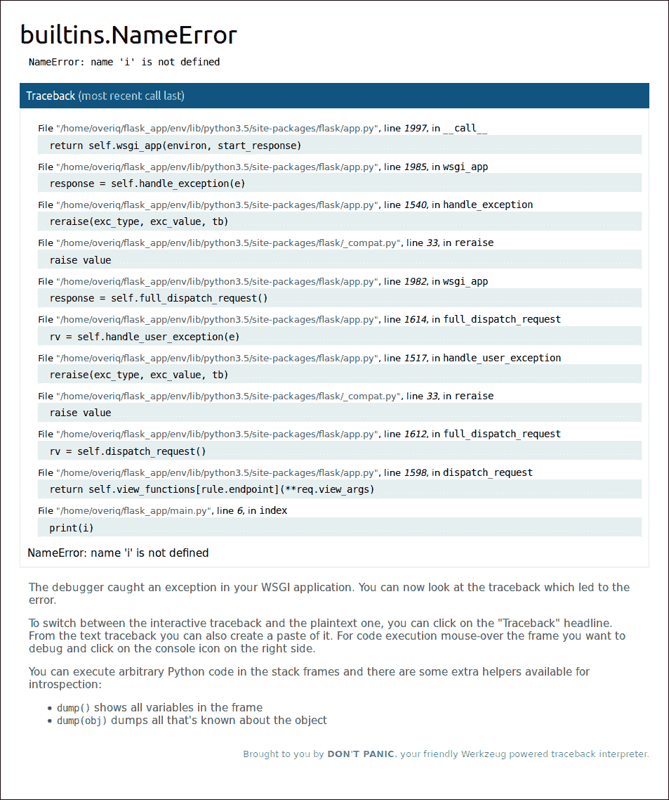
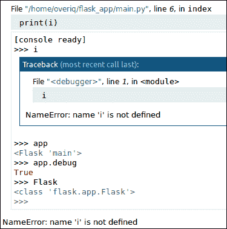
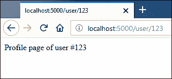

# 烧瓶基础

> 原文:[https://overiq.com/flask-101/flask-basics/](https://overiq.com/flask-101/flask-basics/)

最后更新于 2020 年 7 月 27 日

* * *

## 烧瓶中的你好世界

让我们通过创建一个输出`"Hello World"`的简单应用来开始我们进入 Flask 的冒险。创建一个名为`main.py`的新文件，并在其中输入以下代码。

**烧瓶 _app/main.py**

```py
from flask import Flask
app = Flask(__name__)

@app.route('/')
def index():
    return 'Hello World'

if __name__ == "__main__":
    app.run()

```

我们刚刚在 Flask 中创建了“你好世界”应用。如果`main.py`中的代码对你没有意义，那没关系。在接下来的几节中，我们将更详细地讨论一切。要运行`main.py`，请在虚拟环境中输入以下命令。

```py
(env) overiq@vm:~/flask_app$ python main.py
 * Running on http://127.0.0.1:5000/ (Press CTRL+C to quit)

```

运行`main.py`文件在端口 5000 启动 flask 提供的开发服务器。现在打开你最喜欢的浏览器，访问 [http://127.0.0.1:5000/](http://127.0.0.1:5000/) 查看 Hello World app 的运行情况。


要停止服务器，请按 CTRL+C。

## 实例化烧瓶应用

每个 Flask 应用都必须有一个`Flask`类的实例。该实例实际上是一个 WSGI(网络服务器网关接口)应用，这仅仅意味着网络服务器将它收到的所有请求传递给这个实例进行进一步处理。我们实例化类`Flask`的对象如下:

```py
from flask import Flask
app = Flask(__name__)

```

在第 1 行，我们正在从`flask`包中导入一个名为`Flask`的类。

在第 2 行，我们通过将`__name__`参数传递给`Flask`构造函数来实例化一个`Flask`对象。`Flask`构造函数有一个必需的参数，即应用包的名称。很多时候`__name__`才是正确的价值观。Flask 使用应用包的名称来查找静态资产、模板等。

## 创建路线

路由是将网址绑定到视图函数的行为。视图函数只是一个响应请求的函数。在 Flask 中，我们使用`Flask`实例提供的`route`装饰器将一个网址与一个视图函数相关联。以下是我们如何在 Flask 中创建路线。

```py
@app.route('/')
def index():
    return 'Hello World'

```

这段代码将`index()`视图函数注册为应用根 URL 的处理程序。换句话说，每当应用收到路径为`/`的请求时，将调用`index()`函数来完成请求。

或者，您可以使用`add_url_rule()`方法代替`route`装饰器来定义路线。`add_url_rule()`是一种简单的方法，而不是装饰。除了 URL，它还接受端点和视图函数的名称来调用。端点只是指给路线的唯一名称，通常视图函数的名称用作端点。Flask 可以从一个端点生成 URL，我们将在接下来的课程中学习如何做到这一点。前面的代码相当于下面的代码:

```py
def index():
    return 'Hello World'
app.add_url_rule('/', 'index', index)

```

大多数时候我们会使用`route`装饰器，但是`add_url_rule()`也有它的用途。

view 函数必须返回一个字符串。试图返回其他内容将导致 500 内部服务器错误。

我们可以根据应用需要创建任意多的路由。例如，在下面的列表中，我们创建了三条路线。

```py
@app.route('/')
def index():
    return 'Home Page'

@app.route('/career/')
def career():
    return 'Career Page'

@app.route('/feedback/')
def feedback():
    return 'Feedback Page'

```

当路由中的一个网址以一个尾斜杠(`/`)结束时，Flask 将把没有尾斜杠的请求重定向到有尾斜杠的网址。这意味着对`/career`的请求将被重定向到`/career/`。

我们还可以将多个网址映射到同一个视图函数。例如:

```py
@app.route('/contact/')
@app.route('/feedback/')
def feedback():
    return 'Feedback Page'

```

在这种情况下，每当请求到达`/contact/`或`/feedback/`时，`feedback()`功能将被调用来完成请求。

如果你试图访问一个没有映射到视图函数的网址，你会得到一个 404 找不到的错误。

到目前为止，我们创建的路线都是静态的。现在大多数应用都是由动态网址组成的。动态网址是由一个或多个影响页面输出的可变部分组成的网址。例如，假设您正在构建一个由用户配置文件组成的 web 应用，每个用户都有一个唯一的 id。您想在`/user/1`显示用户#1 的简介，在`/user/2`显示用户#2 的简介，以此类推。解决这个问题的一个笨拙的方法是为每个用户创建一条路线。

相反，我们可以做的是将网址中的动态部分标记为`<variable_name>`。然后，动态部分作为关键字参数传递给视图函数。下面的列表定义了一个包含动态部分的路径。

```py
@app.route('/user/<id>/')
def user_profile(id):
    return "Profile page of user #{}".format(id)

```

在本例中，`<id>`占位符将映射到`/user/` URI 之后的任何东西。例如，如果您访问`/user/100/`，您将获得以下响应。

```py
Profile page of user #100

```

我们不限于数字身份证。以上路线还将匹配`/user/cowboy/`、`/user/foobar10/`、`/user/@@##/`等。然而，它不会像`/user/`和`/user/12/post/`一样匹配 URI。通过指定一个转换器，我们可以将路线限制为仅匹配`/user/` URI 之后的数字标识。

默认情况下，网址的动态部分作为字符串传递给视图函数。我们可以通过在网址的动态部分之前指定一个转换器`<converter:variable_name>`来改变这一点。例如，
`/user/<int:id>/`路由会匹配`/user/1/``/user/2000/`等网址。不会匹配`/user/cowboy/`、`/user/foobar10/`、`/user/@@##/`等网址。

下表列出了 Flask 中可用的所有转换器:

| 转换器 | 描述 |
| --- | --- |
| `string` | 接受任何字符串，这是默认值。 |
| `int` | 接受整数。 |
| `float` | 接受浮点值。 |
| `path` | 接受带前导斜杠和正斜杠的路径名。 |
| `uuid` | 接受 uuid 字符串。 |

## 启动服务器

为了启动开发服务器，我们调用`Flask`对象的`run()`方法。

```py
if __name__ == "__main__":
    app.run()

```

条件`__name__ == "__main__"`保证了`run()`方法只有在`main.py`作为主程序运行时才被调用。如果在另一个 Python 模块中导入`main.py`，则不会调用`run()`方法。

**注:**开发服务器自带 Flask 仅用于开发目的。因此，它将在生产中表现不佳。

现在你应该很清楚`main.py`是如何工作的了。

## 调试方式

编程中的 bug 是不可避免的，迟早你会引入一个。这就是为什么知道如何调试应用并快速修复错误是极其重要的。Flask 附带了一个强大的交互式网络调试器，但默认情况下是关闭的。当调试器关闭并且 Flask 遇到任何错误时，它将显示 500 内部服务器错误。让我们通过在我们的`main.py`文件中故意引入一个 bug 来看看这个行为是如何发生的。打开`main.py`，修改文件如下(修改突出显示):

**烧瓶 _app/main.py**

```py
from flask import Flask
app = Flask(__name__)

@app.route('/')
def index():
    print(i)
    return 'Hello World'

if __name__ == "__main__":
    app.run()

```

这里我们试图打印一个未定义的变量`i`的值，所以我们必然会得到一个错误。如果尚未运行，请启动服务器并访问[。您应该会看到 500 内部服务器错误，如下所示:](http://127.0.0.1:5000/)


尽管如此，浏览器并没有让你看到错误的类型。如果您查看运行服务器的 shell 的标准输出，您将看到刚刚发生的错误的回溯。在这种情况下，回溯如下所示:

```py
File "/home/overiq/flask_app/env/lib/python3.5/site-packages/flask/app.py", line 1612, in full_dispatch_request
    rv = self.dispatch_request()
  File "/home/overiq/flask_app/env/lib/python3.5/site-packages/flask/app.py", line 1598, in dispatch_request
    return self.view_functions[rule.endpoint](**req.view_args)
  File "main.py", line 13, in index
    print(i)
NameError: name 'i' is not defined

```

此外，当调试模式关闭时，每次更改代码后，您都必须手动启动服务器才能使更改生效。打开调试模式将在每次更改后自动重新启动服务器。

要打开调试模式，请将`debug=True`传递给`run()`方法，如下所示:

```py
if __name__ == "__main__":
    app.run(debug=True)

```

开启调试模式的另一种方法是将`Flask`实例的`debug`属性设置为`True`。

```py
from flask import Flask
app = Flask(__name__)
app.debug = True

```

如下修改`main.py`(更改突出显示)并运行。

**烧瓶 _app/main.py**

```py
from flask import Flask
app = Flask(__name__)

@app.route('/')
def index():
    print(i)
    return 'Hello World'

if __name__ == "__main__":
    app.run(debug=True)

```

再次访问 [http://127.0.0.1:5000/](http://127.0.0.1:5000/) ，这次应该会看到 Flask 调试器在运行，如下所示:



如果启用调试器后出现任何错误，您将看到问题的详细追溯，而不是一般的 500 内部服务器错误。通常，回溯给出了发生问题的良好指示。在页面底部，我们可以看到打印语句，该语句试图打印未定义变量`i`的值以及错误类型，这是`NameError`异常，告诉我们名称`i`未定义。

单击回溯中的一行代码将展开问题代码周围的源代码。这对于在解释错误时建立一些上下文非常有用。


您可能已经注意到，当您将鼠标放在一行代码上时，会出现回溯终端图标。单击终端图标会打开一个控制台，您可以在其中执行任何 Python 代码。


这个控制台允许我们在异常发生时检查局部变量。



如果您是第一次打开控制台，它会提示您输入个人识别码。


这是一项安全措施，旨在将对控制台的访问权限限制在授权用户。要访问控制台，您必须输入正确的个人识别码。您可以在运行服务器的Shell的标准输出中找到个人识别码。


让我们通过创建另一个 Flask 应用来结束这一课，该应用实现了我们到目前为止所学的一切。

使用以下代码创建另一个名为`main2.py`的文件:

**烧瓶 _app/main2.py**

```py
from flask import Flask
app = Flask(__name__)

@app.route('/')
def index():
    return 'Hello Flask'

@app.route('/user/<int:user_id>/')
def user_profile(user_id):
    return "Profile page of user #{}".format(user_id)

@app.route('/books/<genre>/')
def books(genre):
    return "All Books in {} category".format(genre)

if __name__ == "__main__":
    app.run(debug=True)

```

运行文件并访问 [http://localhost:5000/](http://localhost:5000/) ，您应该会收到如下“Hello Flask”的问候:


这个新版本的应用增加了两条动态的新路线。让我们测试一下。在您的浏览器地址栏中键入[http://localhost:5000/user/123/](http://localhost:5000/user/123/)，您应该会得到如下响应:



请注意，路由`/user/<int:user_id>/`将只匹配动态部分(即`user_id`)为整数的网址。

要测试第二条动态路线，请访问[http://localhost:5000/books/sci-fi/](http://localhost:5000/books/sci-fi/)。这次你应该得到这样的回应:


此时，如果您试图访问一个未在路由中定义的网址，您将得到一个 404 未找到错误。例如，在访问[http://localhost:5000/products](http://localhost:5000/products)时，应用会以 404 错误进行响应，如下所示:


## 烧瓶如何处理请求？

那么，当 Flask 收到客户端的请求时，它如何知道要执行哪个视图函数呢？

内部 Flask 维护要执行的 URL 和视图函数的映射。这个映射是使用`Flask`实例的`route`装饰器或`add_url_rule()`方法创建的。我们可以使用`Flask`实例的`url_map`属性来访问这个映射。

```py
>>>
>>> from main2 import app
>>> app.url_map
Map([<Rule '/' (OPTIONS, GET, HEAD) -> index>,
 <Rule '/static/<filename>' (OPTIONS, GET, HEAD) -> static>,
 <Rule '/books/<genre>' (OPTIONS, GET, HEAD) -> books>,
 <Rule '/user/<user_id>' (OPTIONS, GET, HEAD) -> user_profile>])
>>>
>>>

```

如输出所示，映射中有 4 个规则。Flask 以以下格式创建网址映射:

```py
url pattern, (comma separated list of HTTP methods handled by the route) -> view function to execute

```

路线`/static/<filename>`由 Flask 自动添加，用于服务静态文件。我们将在第[课](/flask-101/serving-static-files-in-flask/)中讨论如何服务静态文件。

* * *

* * *