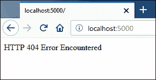

# 烧瓶中的自定义响应和挂钩点

> 原文:[https://overiq . com/flask-101/自定义-响应和挂钩-瓶内点/](https://overiq.com/flask-101/custom-response-and-hook-points-in-flask/)

最后更新于 2020 年 7 月 27 日

* * *

## 自定义响应

Flask 提供了三种不同的模式来创建响应:

1.  作为字符串或使用模板引擎。
2.  作为回应对象。
3.  作为形式为`(response, status, headers)`或`(response, headers)`的元组。

让我们逐一看看这些模式。

## 将响应创建为字符串

```py
@app.route('/books/<genre>')
def books(genre):
    return "All Books in {} category".format(genre)

```

到目前为止，我们已经使用这种模式向客户端发送了响应。当 Flask 看到我们正在从视图函数返回一个字符串时，它会自动将该字符串转换为响应对象(使用`make_response()`方法)，其中字符串作为响应的主体，HTTP 状态代码为 200，`content-type`标头设置为`text/html`。大多数时候这就是你所需要的。但是，有时您需要在向客户端发送响应之前设置一些额外的头。对于这种情况，您必须使用`make_response()`功能创建响应。

## 使用 make_response()创建响应

`make_response()`的语法如下:

```py
res_obj = make_response(res_body, status_code=200)

```

`res_body`是表示响应主体的必需参数，`status_code`是可选的 HTTP 状态代码，默认为 200。

下面的列表显示了如何使用`make_response()`函数设置附加标题。

```py
from flask import Flask, make_response, 

@app.route('/books/<genre>')
def books(genre):
    res = make_response("All Books in {} category".format(genre))
    res.headers['Content-Type'] = 'text/plain'
    res.headers['Server'] = 'Foobar'
    return res

```

下面的列表显示了如何使用`make_response()`函数返回 HTTP 404 错误。

```py
@app.route('/')
def http_404_handler():
    return make_response("<h2>404 Error</h2>", 400)

```

设置 cookies 是 web 应用程序中的另一项常见任务。`make_response()`功能使该操作非常容易。下面的清单在客户端的浏览器中设置了两个 cookies。

```py
@app.route('/set-cookie')
def set_cookie():
    res = make_response("Cookie setter")    
    res.set_cookie("favorite-color", "skyblue")
    res.set_cookie("favorite-font", "sans-serif")
    return res

```

**注:**我们在[课](/flask-101/cookies-in-flask/)中详细讨论饼干。

以上列表设置的 cookies 将持续到浏览器会话。我们可以通过将秒数作为第三个参数传递给`set_cookie()`方法来设置 cookie 的过期时间。例如:

```py
@app.route('/cookie')
def set_cookie():
    res = make_response("Cookie setter")
    res.set_cookie("favorite-color", "skyblue", 60*60*24*15)
    res.set_cookie("favorite-font", "sans-serif", 60*60*24*15)
    return res

```

该列表将 cookies 的过期时间设置为 15 天。

## 使用元组创建响应

创建响应的最后一种模式是使用以下格式之一的元组:

```py
(response, status, headers) 

(response, headers) 

(response, status)

```

`response`是代表响应主体的字符串，`status`是 HTTP 状态代码，可以是整数或字符串，`headers`是包含头值的字典。

```py
@app.route('/')
def http_500_handler():
    return ("<h2>500 Error</h2>", 500)

```

这个视图函数将返回 HTTP 500 内部服务器错误。因为我们可以在创建元组时省略括号，所以上面的代码也可以编写如下:

```py
@app.route('/')
def http_500_handler():
    return "<h2>500 Error</h2>", 500

```

下面的清单显示了如何使用元组设置头:

```py
@app.route('/')
def render_markdown():
    return "## Heading", 200, {'Content-Type': 'text/markdown'}

```

你能猜出下面的视图函数是做什么的吗？

```py
@app.route('/transfer')
def transfer():
    return "", 302, {'location': 'http://localhost:5000/login'}

```

该视图功能使用 HTTP 302 响应代码(临时重定向)将用户重定向到[HTTP://localhost:5000/登录](http://localhost:5000/login)。将用户重定向到不同的页面是如此的普遍，以至于 Flask 提供了一个名为`redirect()`的帮助函数来简化工作。

```py
from flask import Flask, redirect

@app.route('/transfer')
def transfer():
    return redirect("http://localhost:5000/login")

```

默认情况下，`redirect()`执行 HTTP 302 重定向，要执行 HTTP 301 重定向，请将 301 的 HTTP 状态代码传递给`redirect()`函数，如下所示:

```py
from flask import Flask, redirect

@app.route('/transfer')
def transfer():
    return redirect("http://localhost:5000/login", code=301)

```

## 挂钩点

在 web 应用程序中，在每个请求之前和之后执行一些代码是很常见的。例如，假设我们想要记录访问我们的应用程序的用户的 IP 地址，或者在显示隐藏页面之前验证用户。Flask 没有在每个视图函数中复制这样的代码(这很疯狂)，而是为这样的场景提供了以下装饰器:

*   `before_first_request`:这个装饰器在处理第一个请求之前注册一个要执行的函数。

*   `before_request`:这个装饰器在处理请求之前注册一个要执行的函数。

*   `after_request`:这个装饰器注册一个函数，在请求被处理后执行。如果请求处理程序中出现未处理的异常，将不会调用注册的函数。该函数必须接受响应对象并返回相同或新的响应。

*   `teardown_request`:类似于`after_request`装饰器，但是无论请求处理程序是否抛出异常，注册的函数都会一直执行。

请注意，如果`before_request`装饰器注册的函数返回响应，则不会调用请求处理程序。

下面的清单演示了如何利用 Flask 中的钩子点。创建一个名为`hooks.py`的新文件，代码如下所示:

**烧瓶 _app/hooks.py**

```py
from flask import Flask, request, g

app = Flask(__name__)

@app.before_first_request
def before_first_request():
    print("before_first_request() called")

@app.before_request
def before_request():
    print("before_request() called")

@app.after_request
def after_request(response):
    print("after_request() called")
    return response

@app.route("/")
def index():
    print("index() called")
    return '<p>Testings Request Hooks</p>'

if __name__ == "__main__":
    app.run(debug=True)

```

启动服务器，通过访问 [http://localhost:5000/](http://localhost:5000/) 进行第一次请求。在运行服务器的 shell 的标准输出中，您应该会得到以下输出:

```py
before_first_request() called
before_request() called
index() called
after_request() called

```

**注意:**为简洁起见，省略了服务器请求日志。

刷新页面，这次您应该会在 shell 中获得以下输出。

```py
before_request() called
index() called
after_request() called

```

由于这是我们的第二个请求`before_first_request()`功能没有执行。

## 使用中止()中止请求

Flask 提供了一个名为`abort()`的函数，用于终止带有特定错误代码(如 404、500 等)的请求。例如:

```py
from flask import Flask, abort

@app.route('/')
def index():
    abort(404)
    # code after abort() execution will never be executed

```

这个视图函数将返回一个通用的 404 页面，如下所示:


对于其他类型的错误，`abort()`将显示类似的页面。如果您想自定义错误页面，请使用`errorhandler`装饰器，这将在下面讨论。

## 自定义错误页面

`errorhandler`装饰器用于创建自定义错误页面。它接受一个参数，即您正在为其创建自定义错误页的 HTTP 错误代码。打开`hooks.py`文件，使用`errorhandler`装饰器为 HTTP 404 和 HTTP 500 错误创建自定义错误页面，如下所示(更改突出显示):

**烧瓶 _app/hooks.py**

```py
from flask import Flask, request, g, abort
#...
#...
@app.after_request
def after_request(response):
    print("after_request() called")
    return response

@app.errorhandler(404)
def http_404_handler(error):
    return "<p>HTTP 404 Error Encountered</p>", 404

@app.errorhandler(500)
def http_500_handler(error):
    return "<p>HTTP 500 Error Encountered</p>", 500

@app.route("/")
def index():
    # print("index() called")
    # return '<p>Testings Request Hooks</p>'
    abort(404)  

if __name__ == "__main__":
#...

```

请注意，两个错误处理程序都使用一个名为`error`的参数，该参数包含关于所发生的错误类型的附加信息。

如果您现在访问根网址，您将得到以下响应:



* * *

* * *